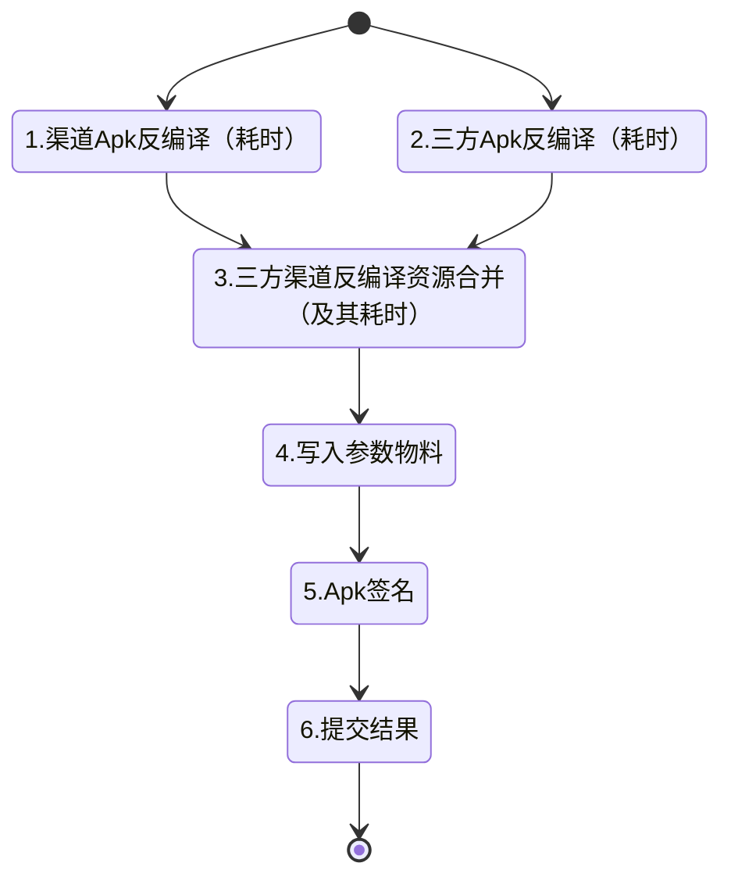

# SDK 自动打包构建服务

## 目的

将反编译构建APK的过程，从手动构建升级为自动构建，并且部署在服务器上，提交任务可以自动构建并且通过指定链接返回结果。

## 资源

> 除了基础的Apk资源包，其他包都是可选的，根据需求场景不同，设计时都有侧重。 
>
> - 如果要提高效率，那么就可以通过空间换时间的方式，存储可复用的资源，多次利用。
> - 如果需要节省空间，那么就保留基础参数，每次都是从头反编译、合并、写参、构建。

### 基础-渠道Apk资源包

渠道资源包是指接入了手游SDK，并且针对不同渠道进行插件配置的专属Apk包。比如（举例）：

- 普通包（没有接入）：仅仅接入了手游SDK的渠道包，一般用于和第三方合作，或者一些没有限制平台的场景。
- 华为包（应用市场）：就是指在接入手游SDK基础上，接入了华为APP-Gallery SDK；这个包是使用的华为的登录体系，但需要通过手游SDK提供游戏服务。
- 爱奇艺（媒体上报）：在接入手游SDK基础上，增加iqiyi SDK，登录注册付费等功能使用手游SDK提供，但产生游戏行为数据时，需要同步上报数据给媒体方。
- 穿山甲（激励广告）：这种包时可以跟上面不同渠道进行组合，根据需求判断是否启用。

根据需求不同，会产生各种各样的渠道Apk包，所以在设计SDK框架时，也要在这方面进行考虑。最好是可以通过CICD，自动化批量构建，并且在代码更新时同步更新构建。

这里建议使用Jenkins，有非常多插件可以使用。Jenkins还提供了对外的API，可以通过接口创建渠道包构建项目，建立一个构建并上传的的项目后，通过API获取其配置，后续有新增渠道时，可以以这个为模板，通过接口去创建新的构建项目。并且可以做一个后台去维护它，可以实现自动化构建项目的配置维护。从而实现渠道自动化构建。

### 基础-第三方APK资源包

这里一般指游戏方接入了我们提供的SDK的游戏Apk文件。游戏一般是只需要接入一次。更新频率相比于SDK低很多，由于游戏接入了SDK，所以只需要保证SDK接口一致，具体的实现通过构建脚本进行更新即可。

### 基础-渠道构建参数

在[构建脚本](build-shell)中参数配置有提到参数物料管理。其实可以将这个功能设计进入这个服务，一方面可以给本服务的资源构建提供数据支持，同时还可以给本地构建提供支持，另一方面，如果数据来源方式比较分散，可以将各个数据源的数据汇总，然后输出统一的格式。

### 渠道合并资源包

> 合并后还未构建的资源源文件。

除了渠道包和三方资源包，在渠道和三方资源包没有更新时，缓存合并后的三方渠道资源包，重复利用，可以将其构建成一个无参数的Apk文件或者进行zip打包，构建这个渠道不同参数时就可以重复利用，节省反编译、合并代码的步骤需要花费的大量的时间。

### 构建成功的Apk资源。

构建成功后，每个三方渠道包加完成参数写入后构建的apk文件，作为结果资源给其他系统提供apk资源。

## 服务设计

**权限**：由于服务主要是后台任务服务，不牵扯太多用户权限相关，可以有前台服务提供，仅仅需要设置一个访问的管理员账号，方便开发这后端调试和调用。

**主要功能**：

- 通过api提交三方渠道打包构建任务，并返回任务id用以查询结果，或者通过url上传结果并通知。
- 通过API管理三方接入了手游SDK的包，并且还有做版本管理。
- 通过API或者CICD管理三方渠道apk物料包。可以方便的查看信息并且更新或者删除该包。
- 检测包更新， 给近期常用的渠道提前构建三方渠道合并资源包。
- 查询包构建参数物料，可以为本地打包或者项目构建提供参数支持。
- （核心）构建打包任务管理服务。用于创建、管理、监测、销毁打包构建任务；
- （可选）维护Jenkins项目配置，可以动态在jenkins上创建或者删除渠道包维护项目。

### 资源管理

资源管理主要管理：渠道apk、三方apk（或者游戏apk）、参数物料。

在设计API时，需要设定以下场景可以使用来设计API：

- 服务端构建时可以直接获取资源包和物料参数。
- 本地构建时，可以选择性的使用API下载资源者使用本地资源包。

可选设计

- 构建Gradle插件，通过唯一Key（例如：AppKey）可以动态获取所有参数，并且通过插件形式配置入项目中。
- 提供API并构建本地UI管理工具。通过本地工具可以直接监测服务，获取打包任务的进度和异常状态等数据，便于快速处理线上问题，并且可以重启任务的每个步骤

**功能设计时需要 重点 注意**：

- 资源是会过期的，由于渠道版本升级、三方apk升级、线上bug版本回滚等，会导致资源失效或者重新启用。在设计时需要牢记这一点。

### 任务设计

根据打包过程的特性，并且尽可能快的提升打包效率，我需要将打包任务拆分成几个小任务，并且关系如下。

其中：

- 任务1和任务2是可以同时进行的
- 任务3需要等待1、2都执行完毕。其他任务需要依次执行。
- 建议是每个任务都由单独的线程池维护（注意拒绝策略）。
- 任务要有失败重试机制，多次失败后，通过管理工具可以进行异常查看，并且再次重试，复现异常场景。
- 在打包任务来临后，有两种方式：
	- 第一种是创建所有任务，并且增加信号量或者任务检测机制，每个任务独立判断是否需要执行或者的等待。
	- 第二种是在持久化中记录任务数据，新建一个任务追踪的任务管理器由单独的线程池维护，每个任务追踪都针对一个物料进行追踪，动态监测每一个任务进度并且创建或者销毁阶段性任务。直到得到打包构建结果并提交。
- 任务4和任务5可以合并为一个任务，好处是可以简化设计，减少线程之间的调度，但在设计划分上会有权责不分明的问题，不便于理解和维护。

## 部署

**局域网部署**：公司本地有空闲的高性能服务器，可以直接部署，直接通过内网访问。不过对本地内网环境要求比较高，如果使用人数较多会导致局域网内部网络卡顿。

**云端部署**：如果需要接入现有的管理系统，并且需要远程操作，那么就需要部署在云端。构建时会占用较大的IO。并且会产生较多的缓存文件，会有一笔不小的开销。

**个人部署**：有时候公司并不会提供支持（别问为啥）。但是又想提高工作效率，可以在公司开发电脑本地部署，并且开放端口，技术能力较强的话写一个简易的UI，将构建服务的地址直接发给需要用的同事，你自己监测即可，注意资源分配，不要影响自己其他的正常工作，不然一堆人访问并打包，直接电脑爆炸，如果时本地，建议直接将所有任务都优化成一个单独的任务即可。

## 多服务器部署设计（极尽资源！）

假设公司财大气粗，本地或者云端有非常多的服务器资源，那么为了进一步的压榨性能，就需要对服务架构做进一步的修改。

我们可以仿照 Gitlab runner 的部分设计，主要的功能都在一个服务中，由各个runner子服务提供给耗时的或者自定义话的任务。所以在设计分布式自动构建时，就可以分为两部分:

- 服务主体：不处理构建任务，只做资源管理和任务管理
- 构建服务runner：构建一个任务管理器，负责任务创建和监听。

### 任务重新设计

首先是服务主体的任务管理器，需要实现以下功能：

- 接受Runner注册，并且有唯一标识符。
- 对每条打包构建任务建立档案，要求可以追踪任务的每个阶段，每个子阶段任务需要有完成标记，并且记录构建服务的唯一标识。
- 根据不同的**构建策略**下发打包子任务。
- **资源任务复用**。有些同渠道不同三方资源、或者同三方资源不同渠道、或者仅仅是物料不同的任务，可以直接查询任务记录，复用这些资源任务的结果。（如果任务正在运行，可以直接加入等待队列（无序的，实现方法自由））

Runner 设计需要保证：

1. 支持六种任务类型。
2. 构建数据和资源持久化。需要记录这个服务构建过的任务和资源，方便服务再次启动时，通过主服务进行资源复用。
3. 每个任务都需要有任务状态可以被实时查询（即使任务结束了，也要保留记录，必要时可以增加持久化，或者使用ELS等日志服务）。
4. 有公共的缓存目录，每个资源针对于系统都有唯一的缓存路径和标识，Runner之间可以互相获取构建之后的资源。
5. 设计一套**评分体系**，用于判断当前服务器是否处于空闲状态。可以根据当前任务数、cpu占用率、内存占用率等进行计算。

### 构建策略

> 其实两种方案在大量的打包任务中，效率都差不多。可以根据开发团队和公司实际情况选择方案。

#### 单任务多服务

分配构建任务时，将不同类型的子任务分配到不同的Runner，分配时，根据当下Runner服务器的**评分**，进行任务分配。

优点是：经可能将任务分配到不同服务器上，并行打包构建，这样可以极大的提升打包效率，在包量特别大时候，可以提供较好的体验。

缺点是：服务之间内部的IO会非常高，并且很多服务上会有各种重复的资源，会使用大量的磁盘空间。

可优化方案：

- 可以监测近期一段时间的任务进行分析，或者可以直接在系统中设置。对于近期构建最多的三方（一般是游戏apk）和渠道进行Runner的指定，比如有十个runner。可以分配六个固定的Runner处理构建任务最多的渠道，剩余的Runner处理其他渠道任务。

- 尽可能让不耗时的任务执行在上一个任务所在的Runner中，减少资源复制。

#### 单任务单服务

分配构建任务时，将同一任务不同子任务放在一个Runner中执行。只有在创建任务时，根据Runner评分，判断是否复用资源还是分配到新Runner中。

优点是：不需要资源频繁复制，减少内网IO流量、减少磁盘占用。

缺点是：对于单个包构建第一次构建、每次更新时，重新反编译合并构建都会占用比较长的时间。

可以优化的方案：

- 根据近期的打包频率最高的渠道，可以将一部分Runner进行渠道划分，可以选择提前构建或者第一次构建资源时，主动将资源分发到其他Runner中，提升构建效率。

### Runner策略

> 有时候可以根据实际情况设定Runner的策略，更加合理的分配利用资源。比如cpu是计算型还是IO型，任务类型占用的磁盘多寡估计。

#### 综合Runner（默认）

支持所有类型任务

#### 资源构建Runner

该Runner仅仅支持资源构建任务。

#### 小型 Runner

该Runner仅支持不耗时的任务，比如写入参数、签名、上报等任务。

### 资源冲突策略

有时候不可避免的会出现多个Runner构建了相同的资源，在有相关的打包任务时，需要定义多种策略：最新构建策略，负载均衡策略等。设计时需要注意资源失效问题。

