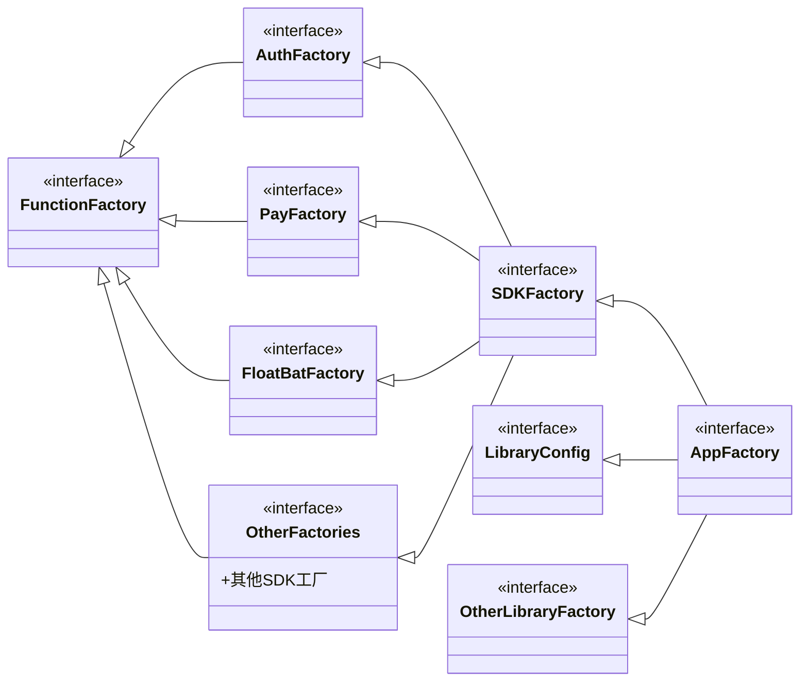

#  手游SDK 设计

## 困境和设计思路

> 主要是讲解设计架构的必要和思路来源，可以跳过。

讨论设计之前，先说一下我的日常工作经验。在日常开发过程中，经常会出现各种功能在不同场景下的需要展示不同的样式或者逻辑需求，比如不同环境下，登录是否显示，样式，请求的网站都有不同，一帮情况下，从零到一的开发，都是有什么需求写什么功能，所以会导致一种情况，一些细小的功能会频繁出现嵌套的 if else

```kotlin
if(...){
} else if(...){
} else if(...){
} else if(...){
} else if(...){
} else if(...){
} else ...
```

或者when语句等，如果从需求角度出发，就是所有的场景逻辑都放在一条逻辑线上，给代码维护和的迭代都带来极大的风险，俗称shi山上堆shi。所以，聪明的人就会开始重构，一知半解的半吊子就会觉是你技术太差。

## 目标

- 全局有两个单例，一个对外提供服务，一个对内提供模块间的调用。
- 解耦需求、功能和模块，让需求、功能、模块之间的改动影响降到最低。
- 某些模块需要在多个功能和模块中调用时（比如数据上报、Activity初始化等），也要达到解耦的效果。
- 可以动态的增加移除模块。（反编译脚本实现）
- 项目结构设计成可以遍历支持CICD的模式。

根据经验，我参考了Retrofit的框架设计，这个时候就可以用到二十四种设计模式中的**代理模式**、**单例模式**、**抽象工厂模式**和**工厂模式**了。并且，所有的设计都是围绕这几个模式展开。

宗旨是：通过**代理**去**动态**调用各个**工厂**。

首先**定义工厂**：通过**接口多继承**，可以将**所有的接口**进行分类，其实这里就是工厂模式的应用，每个模块就是一个工厂，所有的接口就是一个小工厂的集合，可以定义为**总厂**（比如的对外的SDK）。然后可以分别去对工厂进行实现，再使用一个**工厂列表**保存每个工厂的实例，防止每次都去new一个新的实例，也就是必须保证是**单例**。

通过**代理调用**：通过Jvm平台的代理API，可以抽象**总厂**的实现，并返回一个**总厂类型**调用对象。每次调用总厂定义的方法时，都会调用方法：

```java
public interface InvocationHandler {
    public Object invoke(Object proxy, Method method, Object[] args) throws Throwable;
}
```

通过method，可以知道是调用了那个工厂模块，通过工厂列表获取工厂实现，并且通过方法 `method.invoke(...)`可以去调用工厂方法。

> 这里用到了反射，我们常常会提到，反射会降低程序的效率，但正确使用反射情况下，对系统影响微乎其微，这里需要注意的是，只要不反复创建代理，那么它的调用就和普通的方法调用是一样的。所以非常适合用到这里的单例模式。

**工厂多实现**：为了解决一些代码耦合的问题。（这里引入模块的定义，模块是可以实现多个工厂，一个工厂也是有多个模块实现，多对多的关系）比如:

- 所有的模块都都初始化方法。
- 游戏中，进行数据上报时，除了进行正常的接口交互，还需要其他模块同步响应（比如当产生游戏数据上报时，除了自身SDK上报，广告方SDK等第三方也需要调用数据上报）。

其实多实现场景不多，大多数工厂仅有一个实现，并且大多数情况，SDK都是调用通知，或者时调用展示某个功能，所以这里，大多数接口是没有返回值的，我也建议通过回调获取数据。


## SDKFactory和AppFactory 定义

首先，SDK的入口，即像是普通程序main入口一样，SDK的入口是**被调用的API**。被调用的API一般是会通过**单例**创建一个**进程唯一**的**对象**，通过这个对象提供SDK能力或者服务。

先定义接口，即SDK要提供哪些功能对外，这个是一切的基础。并且我一般是使用枚举去实现单例，例如：

```kotlin
class SDKSingleInstance {
    fun instance() : SDKFactory = Singler.INSTANCE.factory
    
    enum Singler(val factory: SDKFactory) {
        INSTANCE(SDKFactory());
    }
}

interface SDKFactory {
    ...
}
```

SDKSingleInstance 可以换成你想要的任何SDK名称，不过我后面会讲到如何通过**注解编程**动态生成这个类文件。

在设计SDK时，需要设计两个调用实例，SDKFactory和AppFactory，一个对外调用提供服务，一个对内调用，在开发时，提供各个模块之间的调用。 例如：

> 注解 暂时不用管，下一章会讲到

```kotlin
/**
 * 对外调用的api
 */
interface SDKFactory : InitFactory, AuthFactory, FloatBatFactory, ...

// 内部调用的api
interface AppFactory : SDKFactory, LibraryConfig, OtherLibraryFactgory, ...

/**
 * 标记是一个功能实现的框架，不定义任何实现，
 * 主要是为了所有的功能实现定义一个统一的父类
 */
interface FunctionFactory

/**
 * 初始化工厂，可以用于任何模块
 */
@SDKModule
interface InitFactory {
    fun initApplicatoin(application:Application)
    fun init(context:Activity)
}

/**
 * 账户验证模块
 */
@SDKModule
interface AuthFactory : FunctionFactory{
    fun login(listener:OnLoginListener) // 登录
    fun register() // 注册
    fun logout() // 登出
}

/**
 * 悬浮球
 */
@SDKModule
interface FloatBatFactory : FunctionFactory {
    fun showFloatBat(context:Context)
    fun hideFloatBat()
}

/**
 * 设置配置
 */
@SDKLibrary
interface LibraryConfig {
    fun setConfig(config: Config)
}

/**
 * 内部Api调用
 */
@SDKLibrary
interface OtherLibraryFactory

...
```




规则：

SDKFactory

- 必须是接口类
- 这个接口是实现了对外的开发需求
- 自动化：实现了所有注解@SDKModule的接口类

AppFactory

- 必须是接口类
- 这个接口实现和定义的实现类都是需要内部调用SDK的接口
- 必须实现 SDKFactory 接口
- 自动化：实现了所有注解 @SDKLibrary 的接口类


## 实现

定义好了SDK的功能，接下来实现它。首先上一章已经定义好了模块。

这里已经定义好了实现方式，基本上都是模板代码，只需要根据实际情况动态模板化添加即可，为了简化认为操作，这里使用了Java特性，**注解编程**，可以通过注解生成模板代码。

> 使用注解编程的好处是，
>
> 1. 可以只关心当前模块实现，而不需要去管理繁琐的配置。
> 2. 降低开发门槛，开发者只需要关注自己的模块实现即可。
> 3. 并且可以固化框架规则，让所有参与开发的人使用同样的规范去实现。

这里不讨论具体原理，只说实现。

> 参考项目：https://github.com/CrazyLeoJay/sdk-auto-services

定义两个标记注解：

```kotlin
/**
 * SDK 模块定义
 */
@Retention(AnnotationRetention.RUNTIME)
@Target(AnnotationTarget.CLASS)
@MustBeDocumented
annotation class SDKModule

/**
 * SDK 内部模块定义
 */
@Retention(AnnotationRetention.RUNTIME)
@Target(AnnotationTarget.CLASS)
@MustBeDocumented
annotation class SDKLibrary

```

在定义的接口和接口实现上都添加这个注解。

另外，定义一个实体注解：

```kotlin
/**
 * 构建单例对象
 *
 * @author leojay`Fu
 * create for 2025/12/22
 *
 * @param value 单例名称
 * @param implInterface 实现的接口类，如果没有就创建一个默认的
 * @param innerInterface 内部调用的接口类，如果没有指定就生成一个默认的
 * @param packagePath 包路径，如果没有设置就使用注册类地址
 * @param proxy 是否使用代理实现，即使用 {@link java.lang.reflect.InvocationHandler} 实现效果
 */
@Retention(AnnotationRetention.SOURCE)
@Target(AnnotationTarget.CLASS)
@MustBeDocumented
annotation class RegisterSDKSingerInstance(
    val value: String,
    val implInterface: KClass<*> = Any::class,
    val innerInterface: KClass<*> = Any::class,
    val packagePath: String = "",
    val packageSuffix: String = "auto",
    val proxy: Boolean = false,
)

```


## @RegisterSDKSingerInstance 注解生成模板代码

```kotlin
/**
 * 定义SDK实例，
 * 并指定对外SDK和对内SDK
 */
@RegisterSDKSingerInstance(
    "AppSDK",
    implInterface = SDKFactory::class,
    innerInterface = AppFactory::class,
    packageSuffix = "register",
)
class AppRegisterThisLibraryService : AppFactory {
	...
}

/**
 * 仅定义SDK，不指定对外和对内的SDK
 * 这里会直接创建 SDKFactory 和 AppFactory 接口，根据注解@SDKModule和@SDKLibrary自动配置依赖
 */
@RegisterSDKSingerInstance("AppSDK")
class AppRegisterThisLibraryService : AppFactory {
	...
}

```

通过注解，则会生成：

```kotlin
package site.leojay.auto.services.app.register

import site.leojay.auto.services.app.*
import site.leojay.auto.services.utils.AutoProxy.autoInvoke
import site.leojay.auto.services.utils.ModulesHelper
import site.leojay.auto.services.utils.ProxyHelperBuilder
import java.lang.reflect.InvocationHandler
import java.lang.reflect.Method
import kotlin.reflect.KClass

public class AppSDK {
    public companion object {
        /**
         * SDK 实例
         */
        @JvmStatic
        public fun instance(): AppFactory = SingleEnum.INSTANCE.factory
    }

    /**
     * 单例枚举
     */
    private enum class SingleEnum(
        public val factory: AppFactory,
    ) {
        /**
         * 直接用注解类实例实现
         */
        INSTANCE(Commons.builder.build()),
        ;
    }

    /**
     * 定义常量参数
     */
    private object Commons {
        /**
         * 定义SDK中所有的功能实现
         */
        private val instances: List<Any> = listOf(AuthFactoryImpl(), PayFactoryImpl())

        /**
         * 定义的不同SDK模块
         */
        private val instanceTypes: List<KClass<*>> =
            listOf(AuthFactory::class, InitFactory::class, PayFactory::class, ConfigFactory::class)

        /**
         * 模块辅助工具
         */
        internal val modulesHelper: ModulesHelper = ModulesHelper(instances, instanceTypes)

        /**
         * 代理辅助工具
         */
        internal val builder: ProxyHelperBuilder<AppFactory> =
            ProxyHelperBuilder<AppFactory>(AppFactory::class, modulesHelper, AppRegisterThisLibraryService())
    }

    public abstract class AbstractSDKFactory : SDKFactory, InvocationHandler {
        protected val app: AppFactory = AppSDK.instance()

        private val sdk: SDKFactory = AppSDK.instance()

        protected val modulesHelper: ModulesHelper = AppSDK.Commons.modulesHelper

        override fun invoke(
            proxy: Any?,
            method: Method,
            args: Array<Any?>?,
        ): Any? = method.autoInvoke(this, args).also {
            method.autoInvoke(sdk, args)
        }
    }
}
```

如果没有指定 SDKFactory 或者 AppFactory , 则会生成：

```kotlin
/*
 * 对外SDK实现
 */
public interface SDKFactory : AuthFactory, InitFactory, PayFactory
/*
 * 对内SDK实现
 */
public interface AppFactory : SDKFactory, ConfigFactory

```

注解工具会**自动分辨**是**类**还是**接口**

在模块辅助工具中，会生成一个`MutableMap<KClass<*>, MutableList<Any>>`。可以通过接口类名称获取实现了这个接口的所有实例。

这里使用`MutableMap`和`MutableList`是考虑到后期可能存在动态注册或者注销模块的功能。如果不需要可以改为`Map`和`List`。

之所以使用List而不是Set，主要是为了有序，Set会导致随机调用，虽然也问题不大，有序的化方便排查。

这样，只需要关心模块实现即可，甚至有些实现可以同时实现多个模块，比如`InitFactory`，这个模块主要是处理初始化，但是很多模块都需要初始化，并且获取Application实例，通过这样的方式，只需要在实现类实现这个接口，工具会自动依次调用。这样设计的好处是，单独的功能模块之间基本没有耦合。即使需要调用，也可以通过定义另外一个全局实例来调用；或者使用一些三方Event工具。


## @SingleInstance 注解生成简单单例

定义：

```kotlin
/**
 * 单例
 *
 * @author leojay`Fu
 * create for 2025/12/22
 *
 * @param implInterface 两种情况，
 *                      1、如果是接口类，可以直接写入
 *                      2、如果接口类是通过 @RegisterSDKSingeInstance 注解生成的，可以返回 @RegisterSDKSingeInstance 注解的类，
 *                      如果直接引入生成的类，会导致注解器找不到类，所以可以通过被注解的主类来找到需要返回的SDKFactory接口
 */
@Retention(AnnotationRetention.SOURCE)
@Target(AnnotationTarget.CLASS)
@MustBeDocumented
annotation class SingleInstance(
    val value: String,
    val implInterface: KClass<*>,
    val packagePath: String = "",
    val packageSuffix: String = "auto",
)
```

实现：

```kotlin
/**
 * 生成一个类 LeojaySDK
 * 并且可以通过 LeojaySDK.instance() 返回一个 SDKFactory 类型 AppRegisterImpl() 实例
 */
@SingleInstance(
    "LeojaySDK",
    implInterface = SDKFactory::class,
)
class AppRegisterImpl : AppSDK.AbstractSDKFactory() {
	...
}

/**
 * 生成一个类 LeojaySDK
 * AppRegisterThisLibraryService 必须注解 @RegisterSDKSingerInstance
 * 并且可以通过 LeojaySDK.instance() 
 * 返回 @RegisterSDKSingerInstance 中定义的 SDKFactory 类型的 AppRegisterImpl() 实例
 */
@SingleInstance(
    "LeojaySDK",
    implInterface = AppRegisterThisLibraryService::class,
)
class AppRegisterImpl : AppSDK.AbstractSDKFactory() {
	...
}
```

生成：

```kotlin
public class LeojaySDK {
  public companion object {
    public fun instance(): SDKFactory = SingleEnum.INSTANCE.factory
  }

  /**
   * 单例枚举
   */
  private enum class SingleEnum(
    public val factory: SDKFactory,
  ) {
    INSTANCE(AppRegisterImpl()),
    ;
  }
}
```


以LeojayProxySDK为例，描述一下SDK类定义

## 【参数】模块(instanceTypes)和实例(instances)

- instances：所有注解了`@SDKModule`或者`@SDKLibrary`的**类实例**
- instanceTypes：所有定义的SDK模块，必须是**接口类**

## 【参数】模块 ModulesHelper 设计

通过这个类来管理注册系统模块。

传入**模块(instanceTypes)**和**实例(instances)** 参数，然后通过以下方法转换为 `MutableMap<KClass<*>, MutableList<Any>> `类型，这样通过接口类型，可以获取实现了接口的功能模块。

```kotlin
companion object {
    private fun List<KClass<*>>.make(modules: List<Any>): MutableMap<KClass<*>, MutableList<Any>> {
        val map = mutableMapOf<KClass<*>, MutableList<Any>>()
        for (klass in this) {
            map[klass] = modules.mapNotNull {
                if (klass.isInstance(it)) it else null
            }.toMutableList()
        }
        return map
    }
}

 /**
  * 设置通用的模块调用
  * 实例化但没有返回值
  * 只是调用，不做返回，由于每个类型会有多个实现，所以我们返回值时，建议使用接口返回，而不是返回值
  * 但其实很多模块最多只有一个调用
  */
 fun invokeNoReturn(klass: KClass<*>, method: Method, args: Array<out Any?>? = null) {
     moduleData[klass]?.forEach {
         method.autoInvoke(it, args = args)
     }
 }
```

这里设计为`MutableMap`和`MutableList`是因为在程序运行中，可以动态增加插件。

- 这里都设置为私有，防止模块被全部卸载。

- 如果想要动态添加减少模块，可以建立同类型不同的对象，并对外提供接口，这样防止自动注册模块被错误操作移除


## 【参数】代理 ProxyHelperBuilder设计

实现模块的实际调用。

```kotlin
/**
 * 代理辅助工具，处理注册代理的调用
 *
 * 使用场景：当有多个接口，或者多个工厂需要统一调用时，
 * 即所有的接口做一个集合，但每个接口都有对应的实现，并不能合并到一起时，这里使用动态代理加注册的方式，自动识别调用的方法是哪个类的实现。并且调用。
 * 但注意，这些接口的名称不能有重复，否则会有冲突
 *
 * @author leojay`Fu
 * create for 2025/12/22
 */
class ProxyHelperBuilder<out T : Any>(
    interfaceClass: KClass<T>,
    private val modulesHelper: ModulesHelper = ModulesHelper(),
    defaultInvoke: Any? = null,
) {
    private val defaultInstance: T = defaultInvoke?.let {
        return@let if (it::class == interfaceClass) {
            it as T
        } else {
            null
        }
    } ?: AutoProxy.proxy(interfaceClass.java)

    private var throwListener: ThrowListener? = null
    private val proxyEntity = AutoProxy.proxy(interfaceClass.java) { _, method, args ->
        val returnResult = AutoProxy.methodInvoke(defaultInstance, method, args)
        // 调用接口方法所在的接口类
        val declaringClass = method.declaringClass

        // 获取注册的功能模块
        if (modulesHelper.hasModule(declaringClass.kotlin)) {
            // 如果该功能模块注册过，就直接执行
            // 每个功能模块可以注册多个，并且多次
            modulesHelper.invokeNoReturn(declaringClass.kotlin, method, args)
        } else {
            // 如果执行到这里 说明调用的方法 没有注册该类的实现
            try {
                throw LeojayAutoException(
                    String.format(
                        "接口方法 %s#%s 没有注册实现",
                        declaringClass.getName(),
                        method.name
                    )
                )
            } catch (e: LeojayAutoException) {
                if (null != throwListener) {
                    // 如果有注册处理接口，就不打印
                    throwListener!!.exception(e)
                } else {
                    throw e
                }
            }
        }
        return@proxy returnResult
    }

    /**
     * 注册异常监听
     *
     * @param listener 异常问题
     * @return this
     */
    fun registerThrowListener(listener: ThrowListener): ProxyHelperBuilder<T> = apply {
        throwListener = listener
    }

    fun build() = proxyEntity
}
```


## 插件化实现（反射）

首先，定义插件模块的接口API，例如应用市场SDK接入模块：

```kotlin
// 定义在公共模块中
interface AppMarketFactory : InitFactory {
    fun login(context: Activity)
    fun pay()
    fun dataUpload(msg: Message)
    ...
}

// 在其他模块中，通过注解工具创建实例
@SDKModuleSingleInstance(
    "AppMarket",
    AppMarketFactory::class,
    packagePath = "site.leojay.android.sdk"
)
class AppMarketFactoryImpl(builder: ProxyHelperBuilder<AppMarketFactory>) : AppMarketFactory {

    override fun login(context: Activity) {
        println("AppMarketFactory login")
    }
}
```

一般情况下，需要在App启动后立马创建，并且注册模块：

> [AutoProxy.instanceThrow() 实现](https://github.com/CrazyLeoJay/sdk-auto-services/blob/master/utils/src/main/kotlin/site/leojay/auto/services/utils/AutoProxy.kt)

```kotlin
...
class ProxySingleService(builder: ProxyHelperBuilder<SDKFactory>) : ... {
    init {
        getAppMarket()?.let { builder.register(AppMarketFactory::class, it) }
    }   
    
    /*
     * 通过反射获取 AppMarket 实例，只要持续持有实例，模块会一直存在，且不会存在内存开销问题
     * 这个方法可在其他工具类中实现，静态调用，或者实现单例
     */
    fun getAppMarket(): AppMarketFactory? {
        val className = "site.leojay.android.sdk.AppMarket"
        val method = "instance"
        try {
            // 这里是通过反射获取了单例，并且调用方法获取单例实例
            val sdk: AppMarketFactory = AutoProxy.instanceThrow(
                AppMarketFactory::class.java, className, method
            )
            return sdk
        } catch (e: Throwable) {
            println("AppMarket 模块不存在")
        }
        return null
    }
    ...
}
```

这样，便加载了一个AppMarket 模块。在项目中不存在时，则不加载，可以增加日志来判断是否真的存在。

然后，我们可以通过各种方式实现插件模块的增减：

- 构建包含不同模块的不同的Apk文件，通过反编译、代码合并、APK构建后加载。
- 通过项目之间的依赖，直接构建不同渠道SDK包。
- 通过接口判断是否加载。但这个方式初始化可能会不及时，或者存在问题。


## 插件化实现（jvm service）

当然还有一种插件化方式，时jvm平台直接提供的，比如，

1. 我们可以在**公共library**中配置**插件API接口**
2. 在插件实现的项目（**插件Library**）中，添加**公共Library**项目，
3. 在**插件Library**中创建服务文件：`classpath:META-INF/services/{这里文件名是定义插件类的全路径名称}`，
4. 在服务文件中，每一行写入**插件API接口**的**实现**。
5. 在**核心代码中（主程序）**中通过**ServiceLoader.load(MyPlugin::class.java)**调用获取。

可以直接使用[Google的Auto库](https://github.com/google/auto/tree/main/service)。

注意的点是，由于**ServiceLoader**重写了**Iterable**，通过 **ServiceLoader**获取插件服务后，**在遍历时**才会创建实例，并且是**每次遍历**都会去**重新创建**，如果需要保证调用，需要主SDK进行实例**缓存**。


## 插件化比较

> 用那种都可以，在实际开发中，我使用的是反射方式获取单例，这样好处有：
>
> - 方式在编译阶段就可以发现冲突，
> - 并且类、实例获取过程都是自己的代码定义的，方便定制化功能。
>
> 坏处也有：
>
> - 需要维护文档引用类的方式、类名都得有规范。有一处不符合就获取不到。可以定制化插件，将规则写入。
> - 不如jvm服务注册有社区、大型公司长期维护。稳定性比较考验开发者得编码水平。

|      | 反射方式                                                     | Jvm 服务注册                                                 |
| ---- | ------------------------------------------------------------ | ------------------------------------------------------------ |
| 实例 | 根据定义规则直接获取单例                                     | 每次遍历都会创建新的实例                                     |
| 数量 | 根据定义方式，仅支持一个获取一个实例，<br />否则在编译时，会有类冲突报错 | 原生态支持，支持一个插件多样化实现                           |
| 规则 | 可以根据规则自定义实现，比较灵活                             | 原生态支持，需要关注实例缓存问题，<br />并且在jvm升级时需要关注相关更新维护。 |


