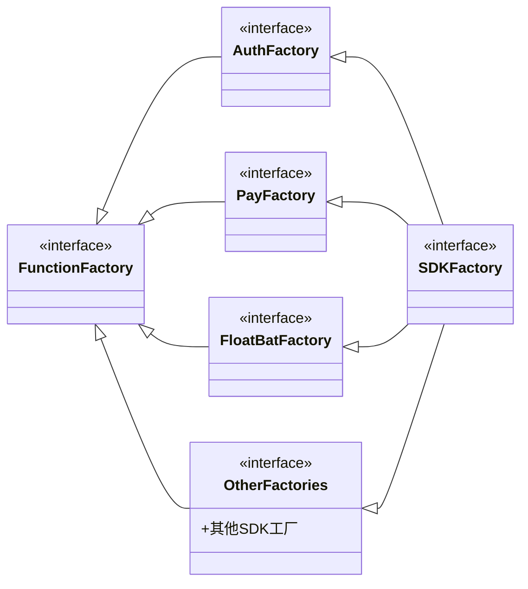

# 手游SDK 设计

## 困境和设计思路

> 主要是讲解设计架构的必要和思路来源，可以跳过。

讨论设计之前，先说一下我的日常工作经验。在日常开发过程中，经常会出现各种功能在不同场景下的需要展示不同的样式或者逻辑需求，比如不同环境下，登录是否显示，样式，请求的网站都有不同，一帮情况下，从零到一的开发，都是有什么需求写什么功能，所以会导致一种情况，一些细小的功能会频繁出现嵌套的 if else

```kotlin
if(...){
} else if(...){
} else if(...){
} else if(...){
} else if(...){
} else if(...){
} else ...
```

或者when语句等，如果从需求角度出发，就是所有的场景逻辑都放在一条逻辑线上，给代码维护和的迭代都带来极大的风险，俗称shi山上堆shi。所以，聪明的人就会开始重构，一知半解的半吊子就会觉是你技术太差。

根据经验，这个时候就可以用到二十四种设计模式中的**抽象工厂模式**和**工厂模式**了。并且，所有的设计都是围绕这两个模式展开。


## SDKFactory 定义SDK接口

首先，SDK的入口，即像是普通程序main入口一样，SDK的入口是**被调用的API**。被调用的API一般是会通过**单例**创建一个**进程唯一**的**对象**，通过这个对象提供SDK能力或者服务。

先定义接口，即SDK要提供哪些功能对外，这个是一切的基础。并且我一般是使用枚举去实现单例，例如：

```kotlin
class SDKSingleInstance {
    fun instance() : SDKFactory = Singler.INSTANCE.factory
    
    enum Singler(val factory: SDKFactory) {
        INSTANCE(SDKFactory());
    }
}

interface SDKFactory {
    ...
}
```

SDKSingleInstance 可以换成你想要的任何SDK名称，不过我后面会讲到如何通过**注解编程**动态生成这个类文件。

对于功能API设计，从设计角度上看，按照功能模块划分，然后统一聚合为 SDKFactory，例如：

> 注解：`@SDKModule`  暂时不用管，下一章会讲到

```kotlin
interface SDKFactory : InitFactory, AuthFactory, FloatBatFactory, ...

/**
 * 标记是一个功能实现的框架，不定义任何实现，
 * 主要是为了所有的功能实现定义一个统一的父类
 */
interface FunctionFactory

/**
 * 初始化工厂，可以用于任何模块
 */
@SDKModule
interface InitFactory {
    fun initApplicatoin(application:Application)
    fun init(context:Activity)
}

/**
 * 账户验证模块
 */
@SDKModule
interface AuthFactory : FunctionFactory{
    fun login(listener:OnLoginListener) // 登录
    fun register() // 注册
    fun logout() // 登出
}

/**
 * 悬浮球
 */
@SDKModule
interface FloatBatFactory : FunctionFactory {
    fun showFloatBat(context:Context)
    fun hideFloatBat()
}

...
```





## SDKFactory实现

定义好了SDK的功能，接下来实现它。首先上一章已经定义好了模块。

这里用到了[注解工具](processor.md)，这里不讨论具体原理，只说实现。

> 参考项目：https://github.com/CrazyLeoJay/sdk-auto-services

我定义一个注解`SDKModule`：

```kotlin
@Retention(AnnotationRetention.RUNTIME)
@Target(AnnotationTarget.CLASS)
@MustBeDocumented
annotation class SDKModule
```

在定义的接口和接口实现上都添加这个注解。

另外，定义一个实体注解：

```kotlin
/**
 * 构建单例对象
 *
 * @author leojay`Fu
 * create for 2025/12/22
 *
 * @param value 单例名称
 * @param implInterface 实现的接口类
 * @param packagePath 包路径，如果没有设置就使用注册类地址
 * @param proxy 是否使用代理实现，即使用 {@link java.lang.reflect.InvocationHandler} 实现效果
 */
@Retention(AnnotationRetention.SOURCE)
@Target(AnnotationTarget.CLASS)
@MustBeDocumented
annotation class SDKModuleSingleInstance (
    val value: String,
    val implInterface: KClass<*>,
    val packagePath: String = "",
    val proxy: Boolean = false,
)
```

`@SDKModuleSingleInstance`注解主要在`SDKFactory`的实现上，用于生成单例。例如定义类`ProxySingleService`：

```kotlin
@SDKModuleSingleInstance("LeojayProxySDK", implInterface = SDKFactory::class, proxy = true)
class ProxySingleService(helper: ProxyHelperBuilder<SDKFactory>) : ProxyInstance<SDKFactory>(helper), SDKFactory {
    override fun defaultSDKEntity(): SDKFactory {
        // 不可以new新实例，最好是在Class中创建后再引用，或者使用this
        return this
    }
    ...
}
```

通过注解，则会生成：

```kotlin
package site.leojay.auto.services.app

import kotlin.Any
import kotlin.collections.List
import kotlin.jvm.JvmStatic
import kotlin.reflect.KClass
import site.leojay.auto.services.utils.AutoProxy
import site.leojay.auto.services.utils.ModulesHelper
import site.leojay.auto.services.utils.ProxyHelperBuilder
import site.leojay.auto.services.utils.ProxyHelperBuilder.Companion.register

public class LeojayProxySDK {
  public companion object {
    /**
     * SDK 实例
     */
    @JvmStatic
    public fun instance(): SDKFactory = SingleEnum.INSTANCE.instance
  }

  /**
   * 单例枚举
   */
  private enum class SingleEnum(
    public val instance: SDKFactory,
  ) {
    /**
     * 通过代理创建实现接口
     */
    INSTANCE(AutoProxy.proxy(SDKFactory::class.java, ProxySingleService(Commons.builder))),
    ;
  }

  /**
   * 定义常量参数
   */
  private object Commons {
    /**
     * 定义SDK中所有的功能实现
     */
    private val instances: List<Any> = listOf(AuthFactoryImpl(), PayFactoryImpl())

    /**
     * 定义的不同SDK模块
     */
    private val instanceTypes: List<KClass<*>> =
        listOf(AuthFactory::class, InitFactory::class, PayFactory::class)

    /**
     * 模块辅助工具
     */
    private val modulesHelper: ModulesHelper = ModulesHelper(instances, instanceTypes)

    /**
     * 代理辅助工具
     */
    public val builder: ProxyHelperBuilder<SDKFactory> =
        ProxyHelperBuilder(SDKFactory::class, modulesHelper)
  }
}
```

注解过的模块接口和模块实现，会在这个类中定义。

- instances：所有注解了`@SDKModule`的**类**
- instanceTypes：所有定义的SDK模块，必须是**接口类**

注解工具会**自动分辨**是**类**还是**接口**

在模块辅助工具中，会生成一个`MutableMap<KClass<*>, MutableList<Any>>`。可以通过接口类名称获取实现了这个接口的所有实例。

这里使用`MutableMap`和`MutableList`是考虑到后期可能存在动态注册或者注销模块的功能。如果不需要可以改为`Map`和`List`。

之所以使用List而不是Set，主要是为了有序，Set会导致随机调用，虽然也问题不大，有序的化方便排查。

这样，只需要关心模块实现即可，甚至有些实现可以同时实现多个模块，比如`InitFactory`，这个模块主要是处理初始化，但是很多模块都需要初始化，并且获取Application实例，通过这样的方式，只需要在实现类实现这个接口，工具会自动依次调用。这样设计的好处是，单独的功能模块之间基本没有耦合。即使需要调用，也可以通过定义另外一个全局实例来调用；或者使用一些三方Event工具。


## 【SDK定义】模块(instanceTypes)和实例(instances)


## 【SDK定义】单例


## 【SDK定义】内部模块（innerInstanceTypes）


## 【SDK定义】模块 ModulesHelper 设计


## 【SDK定义】代理 ProxyHelperBuilder设计


## 插件化实现（反射）

首先，定义插件模块的接口API，例如应用市场SDK接入模块：

```kotlin
// 定义在公共模块中
interface AppMarketFactory : InitFactory {
    fun login(context: Activity)
    fun pay()
    fun dataUpload(msg: Message)
    ...
}

// 在其他模块中，通过注解工具创建实例
@SDKModuleSingleInstance(
    "AppMarket",
    AppMarketFactory::class,
    packagePath = "site.leojay.android.sdk"
)
class AppMarketFactoryImpl(builder: ProxyHelperBuilder<AppMarketFactory>) : AppMarketFactory {

    override fun login(context: Activity) {
        println("AppMarketFactory login")
    }
}
```

一般情况下，需要在App启动后立马创建，并且注册模块：

> [AutoProxy.instanceThrow() 实现](https://github.com/CrazyLeoJay/sdk-auto-services/blob/master/utils/src/main/kotlin/site/leojay/auto/services/utils/AutoProxy.kt)

```kotlin
...
class ProxySingleService(builder: ProxyHelperBuilder<SDKFactory>) : ... {
    init {
        getAppMarket()?.let { builder.register(AppMarketFactory::class, it) }
    }   
    
    /*
     * 通过反射获取 AppMarket 实例，只要持续持有实例，模块会一直存在，且不会存在内存开销问题
     * 这个方法可在其他工具类中实现，静态调用，或者实现单例
     */
    fun getAppMarket(): AppMarketFactory? {
        val className = "site.leojay.android.sdk.AppMarket"
        val method = "instance"
        try {
            // 这里是通过反射获取了单例，并且调用方法获取单例实例
            val sdk: AppMarketFactory = AutoProxy.instanceThrow(
                AppMarketFactory::class.java, className, method
            )
            return sdk
        } catch (e: Throwable) {
            println("AppMarket 模块不存在")
        }
        return null
    }
    ...
}
```

这样，便加载了一个AppMarket 模块。在项目中不存在时，则不加载，可以增加日志来判断是否真的存在。

然后，我们可以通过各种方式实现插件模块的增减：

- 构建包含不同模块的不同的Apk文件，通过反编译、代码合并、APK构建后加载。
- 通过项目之间的依赖，直接构建不同渠道SDK包。
- 通过接口判断是否加载。但这个方式初始化可能会不及时，或者存在问题。


## 插件化实现（jvm service）

当然还有一种插件化方式，时jvm平台直接提供的，比如，

1. 我们可以在**公共library**中配置**插件API接口**
2. 在插件实现的项目（**插件Library**）中，添加**公共Library**项目，
3. 在**插件Library**中创建服务文件：`classpath:META-INF/services/{这里文件名是定义插件类的全路径名称}`，
4. 在服务文件中，每一行写入**插件API接口**的**实现**。
5. 在**核心代码中（主程序）**中通过**ServiceLoader.load(MyPlugin::class.java)**调用获取。

可以直接使用[Google的Auto库](https://github.com/google/auto/tree/main/service)。

注意的点是，由于**ServiceLoader**重写了**Iterable**，通过 **ServiceLoader**获取插件服务后，**在遍历时**才会创建实例，并且是**每次遍历**都会去**重新创建**，如果需要保证调用，需要主SDK进行实例**缓存**。


## 插件化比较

> 用那种都可以，在实际开发中，我使用的是反射方式获取单例，这样好处有：
>
> - 方式在编译阶段就可以发现冲突，
> - 并且类、实例获取过程都是自己的代码定义的，方便定制化功能。
>
> 坏处也有：
>
> - 需要维护文档引用类的方式、类名都得有规范。有一处不符合就获取不到。可以定制化插件，将规则写入。
> - 不如jvm服务注册有社区、大型公司长期维护。稳定性比较考验开发者得编码水平。

|      | 反射方式                                                     | Jvm 服务注册                                                 |
| ---- | ------------------------------------------------------------ | ------------------------------------------------------------ |
| 实例 | 根据定义规则直接获取单例                                     | 每次遍历都会创建新的实例                                     |
| 数量 | 根据定义方式，仅支持一个获取一个实例，<br />否则在编译时，会有类冲突报错 | 原生态支持，支持一个插件多样化实现                           |
| 规则 | 可以根据规则自定义实现，比较灵活                             | 原生态支持，需要关注实例缓存问题，<br />并且在jvm升级时需要关注相关更新维护。 |


