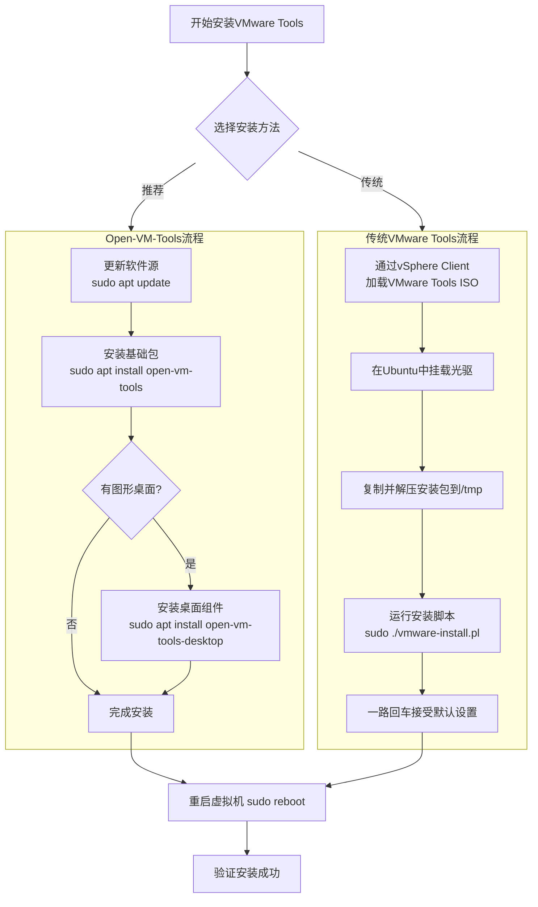

# **VMware Tools** 安装

在ESXi 6.7的Ubuntu虚拟机中安装VMware Tools可以提高虚拟机性能、改善管理功能（如鼠标集成、剪贴板共享）、并支持高级功能如文件共享。下面为你提供两种主流的安装方法。

🎯 **安装前的准备**
在开始安装之前，请确保你的Ubuntu虚拟机已启动并可正常运行。建议为Ubuntu虚拟机**分配至少2GB内存**，并为根目录`/` **预留10GB以上的磁盘空间**，以保证安装过程顺畅。同时，**更新Ubuntu软件包列表**总是一个好习惯：
```bash
sudo apt update
```

### 方法一：通过VMware界面安装（推荐）

这是最直接的方法，利用ESXi提供的虚拟光驱进行安装。

1.  **加载ISO镜像**：
    在vSphere Client中，右键你的Ubuntu虚拟机，选择“操作” -> “客户机OS” -> **“安装/升级VMware Tools”**。这会将一个包含VMware Tools安装文件的ISO镜像虚拟地连接到虚拟机的光驱上。

2.  **挂载光驱**：
    在Ubuntu虚拟机中，打开终端，创建挂载点并挂载光驱。光驱设备通常是`/dev/sr0`或`/dev/cdrom`。
    ```bash
    sudo mkdir -p /mnt/cdrom    # 创建挂载点目录
    sudo mount /dev/cdrom /mnt/cdrom  # 挂载光驱到该目录
    ```
    如果系统提示设备繁忙或已挂载在其他位置，请使用`mount | grep cdrom`查看实际挂载点。

3.  **复制并解压安装文件**：
    将安装包复制到临时目录并解压。
    ```bash
    cp /mnt/cdrom/VMwareTools-*.tar.gz /tmp/  # 复制到/tmp目录
    cd /tmp
    tar -xzf VMwareTools-*.tar.gz    # 解压安装包
    ```

4.  **运行安装脚本**：
    解压后会生成一个`vmware-tools-distrib`目录，进入其中并以root权限运行安装脚本。
    ```bash
    cd vmware-tools-distrib/
    sudo ./vmware-install.pl    # 执行安装脚本
    ```

5.  **完成安装**：
    安装脚本会交互式地提出问题。**除非你明确知道需要更改，否则一路按 `Enter` 键接受所有默认设置即可**。安装完成后，**最好重启Ubuntu虚拟机**以使所有驱动和功能生效。
    ```bash
    sudo reboot
    ```

### 方法二：使用Open VM Tools（更推荐）

**Open VM Tools (open-vm-tools)** 是VMware官方推荐并维护的开源替代品。它通常**直接包含在Ubuntu的软件源中**，安装和升级都更加方便，无需手动处理ISO镜像，并能通过系统的标准更新机制自动获取更新。

1.  **安装open-vm-tools**：
    在终端中运行以下命令：
    ```bash
    sudo apt update
    sudo apt install open-vm-tools  # 安装基础服务组件
    ```

2.  **安装桌面功能组件（可选）**：
    如果你为Ubuntu安装了图形化桌面环境（如GNOME, Unity），并需要**拖放文件、剪贴板共享、图形界面分辨率自适应**等功能，还需安装桌面组件：
    ```bash
    sudo apt install open-vm-tools-desktop  # 安装桌面交互功能组件
    ```

3.  **重启虚拟机**：
    安装完成后，同样**重启虚拟机**来确保服务正确启动。
    ```bash
    sudo reboot
    ```

---

### 💡 安装选择与注意事项

为了帮你更直观地做出选择，可以参考下面的表格：

| 特性/方面          | Open VM Tools (方法二)                                  | 传统VMware Tools (方法一)                        |
| :----------------- | :------------------------------------------------------ | :----------------------------------------------- |
| **推荐度**         | ⭐⭐⭐⭐⭐ **(官方推荐，现代方式)**                          | ⭐⭐⭐ (传统方式)                                  |
| **维护性**         | **高**，通过系统包管理器(`apt`)轻松安装和更新             | **低**，需手动下载和安装新版本                     |
| **便利性**         | **非常方便**，几条命令即可，无需挂载ISO                   | **相对麻烦**，需挂载ISO并手动执行安装脚本          |
| **主要功能支持**   | **完整支持**ESXi和vSphere的各项功能                      | 同样支持所有核心功能                               |
| **适用场景**       | **绝大多数场景**，尤其是新部署的虚拟机                    | 某些非常旧的或定制化的Linux发行版（如无网络环境） |

#### **可能遇到的问题与解决方法**

*   **共享文件夹不显示**：安装Open VM Tools或VMware Tools后，如果在`/mnt/hgfs`下看不到设置的共享文件夹，可以尝试手动挂载：
    ```bash
    sudo vmhgfs-fuse .host:/ /mnt/hgfs -o allow_other  # 手动挂载共享文件夹
    ```
    为了让其开机自动挂载，可将上述命令添加到`/etc/rc.local`文件中（确保该文件有执行权限）。

*   **无法定位软件包 open-vm-tools**：确保Ubuntu虚拟机**能正常访问互联网**，并且已运行`sudo apt update`更新软件源列表。

*   **安装过程中缺少编译器或头文件**：极少数情况下，传统VMware Tools安装脚本（`vmware-install.pl`）可能需要编译内核模块。如果报错提示缺少`gcc`, `make`, `kernel-headers`等，请安装它们：
    ```bash
    sudo apt install build-essential linux-headers-$(uname -r)  # 安装编译环境和当前内核的头文件
    ```
    然后再重新运行安装脚本。

*   **无法剪贴板共享/拖放**：首先确认已安装了`open-vm-tools-desktop`。如果问题依旧，可以尝试**重启VMware Tools服务**：
    ```bash
    sudo systemctl restart open-vm-tools
    ```
    某些桌面环境也可能需要你检查相关设置。

---

### 📊 核心步骤概览

以下是安装过程的核心步骤概览，帮助你快速把握全过程。



### ✅ 验证安装是否成功

无论采用哪种方法，安装并重启后，可以通过以下命令检查VMware Tools服务是否在运行：
```bash
sudo systemctl status open-vm-tools   # 如果使用方法二
# 或者
sudo ps aux | grep vmtoolsd           # 检查传统VMware Tools进程
```
如果看到相关的进程正在运行，通常表示安装成功。

希望这些信息能帮助你顺利完成安装！

