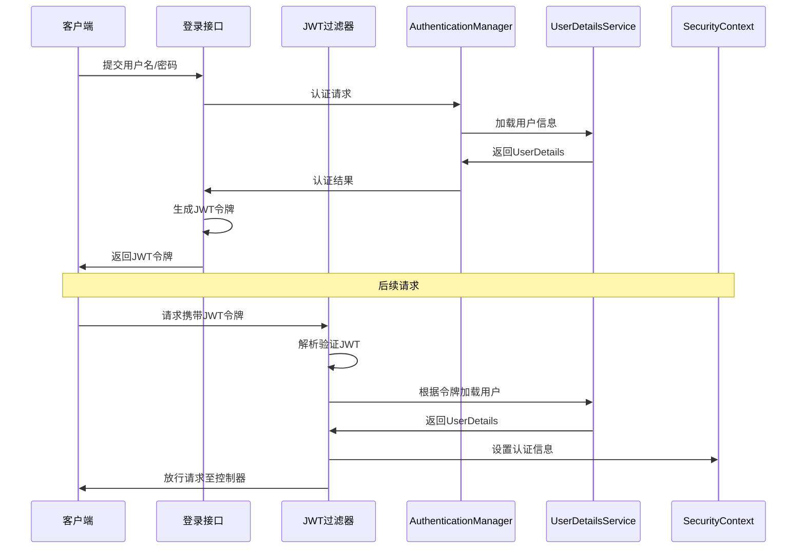

在不配置 `formLogin` 的情况下，结合 JWT 进行认证和用户信息过滤，是前后端分离项目中常见的做法。下面我将为您梳理配置的关键步骤和示例。

### JWT 认证配置核心步骤

通常，一个完整的 JWT 认证流程主要涉及以下几个方面：

1.  **创建与解析 JWT 的工具类**：负责生成 JWT 令牌、解析令牌以及验证令牌的有效性。
2.  **实现一个 JWT 认证过滤器**：负责在请求到达控制器之前，从请求头中提取 JWT 令牌并进行验证。
3.  **配置 Spring Security**：核心是禁用表单登录、CSRF 等，并将自定义的 JWT 过滤器添加到安全过滤器链中。
4.  **提供登录接口**：验证用户凭证，成功后调用 JWT 工具类生成令牌并返回。

其中的关键流程，您可以参考以下序列图来理解：


### 🛠️ 具体配置与代码示例

#### 1. 创建 JWT 工具类

这个类负责 JWT 令牌的生成、解析和验证。

```java
@Component
public class JwtTokenUtil {
    // 从application.yml配置中读取
    @Value("${jwt.secret}")
    private String secret;
    @Value("${jwt.expiration}")
    private Long expiration;
    @Value("${jwt.header}")
    private String header;

    // 生成JWT令牌
    public String generateToken(UserDetails userDetails) {
        Map<String, Object> claims = new HashMap<>();
        claims.put("sub", userDetails.getUsername()); // 用户名
        claims.put("created", new Date()); // 创建时间
        return Jwts.builder()
                .setClaims(claims)
                .setExpiration(new Date(System.currentTimeMillis() + expiration))
                .signWith(SignatureAlgorithm.HS512, secret)
                .compact();
    }

    // 从令牌中获取用户名
    public String getUsernameFromToken(String token) {
        return getClaimsFromToken(token).getSubject();
    }

    // 验证令牌是否有效
    public Boolean validateToken(String token, UserDetails userDetails) {
        String username = getUsernameFromToken(token);
        return (username.equals(userDetails.getUsername()) && !isTokenExpired(token));
    }

    // 判断令牌是否过期
    private Boolean isTokenExpired(String token) {
        Date expiration = getClaimsFromToken(token).getExpiration();
        return expiration.before(new Date());
    }

    // 从令牌中获取数据声明（Claims）
    private Claims getClaimsFromToken(String token) {
        return Jwts.parser()
                .setSigningKey(secret)
                .parseClaimsJws(token)
                .getBody();
    }
}
```
在 `application.yml` 中的配置示例：
```yaml
jwt:
  secret: mySecretKey # 用于签名JWT的密钥，生产环境请务必妥善保管
  expiration: 86400000 # 令牌有效期（毫秒），例如24小时
  header: Authorization # 前端携带令牌的请求头名称
```

#### 2. 实现 JWT 认证过滤器

这个过滤器负责在每个请求到来时，检查并验证 JWT。

```java
public class JwtAuthenticationTokenFilter extends OncePerRequestFilter {

    @Autowired
    private JwtTokenUtil jwtTokenUtil;
    
    // 假设你有一个自定义的UserDetailsService实现
    @Autowired
    private UserDetailsService userDetailsService; 

    @Override
    protected void doFilterInternal(HttpServletRequest request, 
                                    HttpServletResponse response, 
                                    FilterChain chain) 
            throws ServletException, IOException {
        
        // 1. 从请求头获取JWT令牌
        String authHeader = request.getHeader(jwtTokenUtil.getHeader()); 
        if (authHeader != null && authHeader.startsWith("Bearer ")) {
            String authToken = authHeader.substring(7); // 去掉"Bearer "前缀
            // 2. 从JWT中提取用户名
            String username = jwtTokenUtil.getUsernameFromToken(authToken);
            
            // 3. 验证令牌有效性并设置安全上下文
            if (username != null && 
                SecurityContextHolder.getContext().getAuthentication() == null) {
                UserDetails userDetails = this.userDetailsService.loadUserByUsername(username);
                if (jwtTokenUtil.validateToken(authToken, userDetails)) {
                    UsernamePasswordAuthenticationToken authentication = 
                        new UsernamePasswordAuthenticationToken(
                            userDetails, null, userDetails.getAuthorities());
                    authentication.setDetails(new WebAuthenticationDetailsSource().buildDetails(request));
                    // 将认证信息设置到SecurityContext中
                    SecurityContextHolder.getContext().setAuthentication(authentication);
                }
            }
        }
        chain.doFilter(request, response);
    }
}
```

#### 3. 配置 Spring Security

这是核心配置，需要禁用表单登录，并将自定义过滤器加入链路。

```java
@Configuration
@EnableWebSecurity
@EnableGlobalMethodSecurity(prePostEnabled = true) // 启用方法级安全控制
public class SecurityConfig {

    @Autowired
    private JwtAuthenticationTokenFilter jwtAuthenticationTokenFilter;
    
    // 注意：在Spring Security 5.7.0及以上，WebSecurityConfigurerAdapter已过时
    @Bean
    public SecurityFilterChain filterChain(HttpSecurity http) throws Exception {
        http
            // 禁用CSRF（因为JWT是无状态的）
            .csrf().disable()
            // 设置会话为无状态（因为JWT本身包含会话信息）
            .sessionManagement().sessionCreationPolicy(SessionCreationPolicy.STATELESS)
            .and()
            .authorizeRequests()
            // 登录接口允许匿名访问
            .antMatchers("/api/auth/login").permitAll() 
            // 其他所有请求都需要认证
            .anyRequest().authenticated();

        // 将JWT过滤器添加到UsernamePasswordAuthenticationFilter之前
        http.addFilterBefore(jwtAuthenticationTokenFilter, 
                            UsernamePasswordAuthenticationFilter.class);
        
        return http.build();
    }
    
    // 密码编码器
    @Bean
    public PasswordEncoder passwordEncoder() {
        return new BCryptPasswordEncoder();
    }
}
```

#### 4. 实现登录接口

这个接口负责验证用户凭证，并在成功后生成并返回 JWT 令牌。

```java
@RestController
@RequestMapping("/api/auth")
public class AuthController {
    
    @Autowired
    private AuthenticationManager authenticationManager;
    
    @Autowired
    private JwtTokenUtil jwtTokenUtil;
    
    @PostMapping("/login")
    public ResponseEntity<?> login(@RequestBody LoginRequest loginRequest) {
        try {
            // 使用Spring Security的AuthenticationManager进行认证
            Authentication authentication = authenticationManager.authenticate(
                new UsernamePasswordAuthenticationToken(
                    loginRequest.getUsername(), 
                    loginRequest.getPassword()
                )
            );
            
            // 认证成功后生成JWT
            SecurityContextHolder.getContext().setAuthentication(authentication);
            UserDetails userDetails = (UserDetails) authentication.getPrincipal();
            String token = jwtTokenUtil.generateToken(userDetails);
            
            // 返回令牌给客户端
            return ResponseEntity.ok(new JwtResponse(token));
            
        } catch (BadCredentialsException e) {
            return ResponseEntity.status(HttpStatus.UNAUTHORIZED)
                               .body("用户名或密码错误");
        }
    }
}
// 登录请求和响应的DTO
class LoginRequest {
    private String username;
    private String password;
    // getters and setters
}
class JwtResponse {
    private String token;
    // constructor, getters and setters
}
```

### 💡 重要提示

- **过滤器注入问题**：如果你的自定义 JWT 过滤器同时使用了 `@Component` 注解，并且在配置中通过 `@Bean` 方式再次注入，可能会导致过滤器执行两次。通常建议只选择其中一种方式。
- **异常处理**：在 JWT 过滤器中，如果认证失败（如令牌无效或过期），**不要**在 `doFilterInternal` 方法中直接捕获异常并返回响应，这可能导致 Spring Security 的 `ExceptionTranslationFilter` 无法正常处理后续的授权异常。正确的做法是让异常抛出，由后续的过滤器处理。你可以自定义 `AuthenticationEntryPoint` 来处理认证异常（如令牌无效），自定义 `AccessDeniedHandler` 来处理授权异常（如权限不足）。
- **密钥安全**：JWT 的签名密钥 (`secret`) 非常重要，**切勿硬编码在代码中**。在生产环境中，应通过环境变量、配置服务器等安全方式管理。

希望这些详细的步骤和代码示例能帮助你顺利配置 Spring Security 与 JWT。如果你在实现过程中遇到更具体的问题，比如特定异常的處理或者角色权限的动态加载，欢迎随时提出！