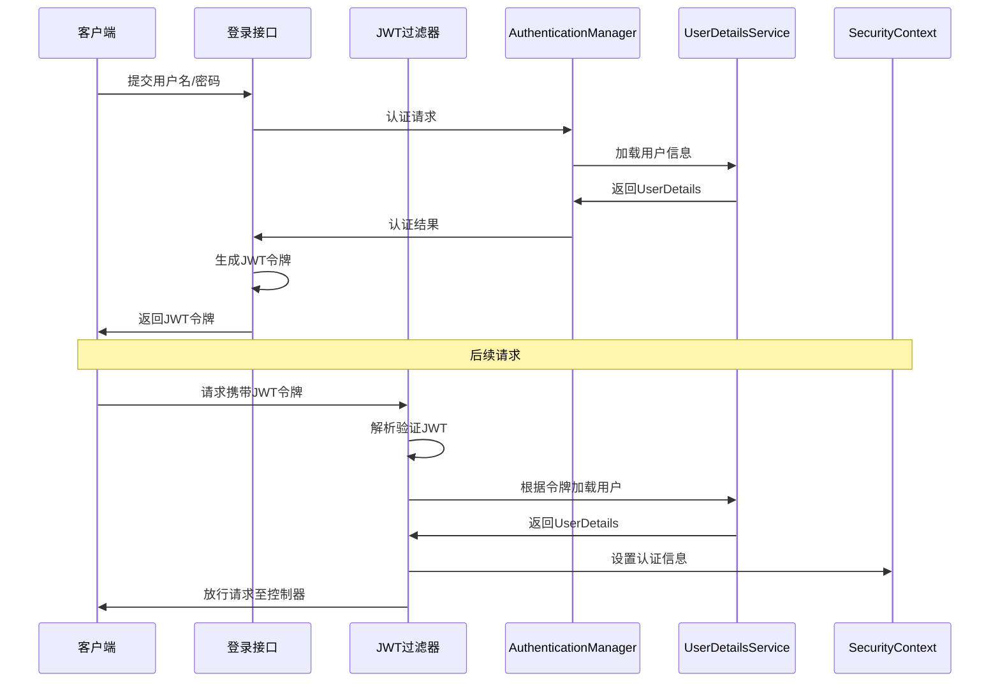

# Spring Boot Security 笔记

## JWT 配置

```mermaid
sequenceDiagram
    participant C as 客户端
    participant L as 登录接口
    participant J as JWT过滤器
    participant AM as AuthenticationManager
    participant UDS as UserDetailsService
    participant SC as SecurityContext
    
    C->>L: 提交用户名/密码
    L->>AM: 认证请求
    AM->>UDS: 加载用户信息
    UDS->>AM: 返回UserDetails
    AM->>L: 认证结果
    L->>L: 生成JWT令牌
    L->>C: 返回JWT令牌
    
    Note over C,SC: 后续请求
    C->>J: 请求携带JWT令牌
    J->>J: 解析验证JWT
    J->>UDS: 根据令牌加载用户
    UDS->>J: 返回UserDetails
    J->>SC: 设置认证信息
    J->>C: 放行请求至控制器
```

