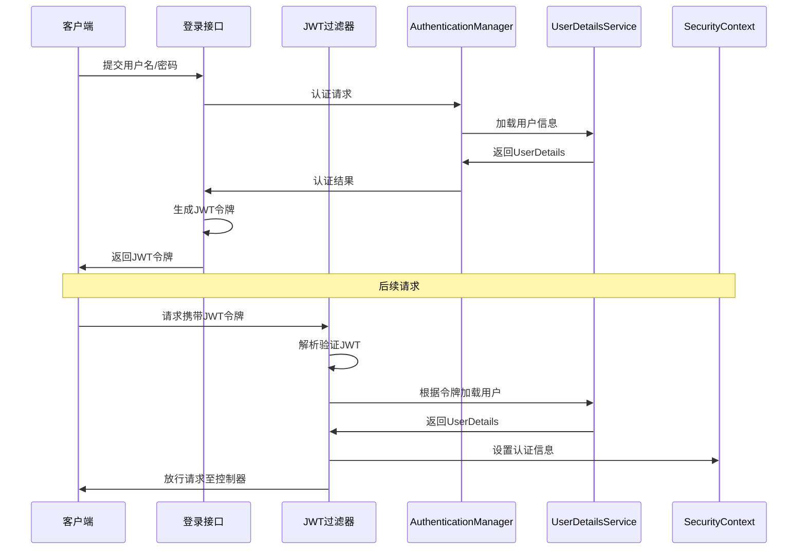

# Spring Boot Security 笔记

[TOC]

## 依赖导入

- [Docs: Getting Spring Security](https://docs.spring.io/spring-security/reference/getting-spring-security.html#getting-maven-no-boot)

```groovy
dependencies {
	implementation("org.springframework.boot:spring-boot-starter-security")
}
```


## 基本流程

> 必须配置的项目

### 启用功能

首先得使用注解启用 Security 功能，这里使用 `SecurityConfig` 作为配置类

```kotlin
@Configuration
@EnableWebSecurity // 启用Security
@EnableMethodSecurity( // 方法注解中启用授权注解使用
    prePostEnabled = true,    // 启用 @PreAuthorize, @PostAuthorize
    securedEnabled = true,    // 启用 @Secured
    jsr250Enabled = true      // 启用 JSR-250 注解 (@RolesAllowed 等)
)
class SecurityConfig
```


### 用户信息获取

> 用户信息可以存于内存、数据库、或者自己定义的任何存储，这里主要展示自己定义实现，并且获取用户信息过程

官方文档：

- [Password Storage UserDetails](https://docs.spring.io/spring-security/reference/servlet/authentication/passwords/user-details.html#servlet-authentication-userdetails)
- [UserDetailsService](https://docs.spring.io/spring-security/reference/servlet/authentication/passwords/user-details-service.html#page-title)

这一步主要服务于，在用户请求来临时，如何获取账户信息和账户得角色权限信息

通过声明 `@Bean` 来声明 `UserDetailsService`实例。

- 构造函数可以为空，这里主要是通过构造函数给获取用户数据提供数据源

```kotlin
@Bean
fun userDetailsService(
    authService: AuthSecurityService,
    appConfigProperties: AppConfigProperties
): UserDetailsService {
    // 注册用户获取方式
    return DefaultUserDetailsService(authService, appConfigProperties)
}
```


`DefaultUserDetailsService`的实现

- 构造

```kotlin
class DefaultUserDetailsService(private val authService: AuthSecurityService, val appConfig: AppConfigProperties) :
    UserDetailsService {

    /**
    * 主要实现方法
    */
    override fun loadUserByUsername(username: String?): UserDetails {
     	// 这里省略实现逻辑
        return User.withUsername(entity.username)
            .password(entity.password)
//            .roles(*roles) // 角色 数据会和 authorities 参数覆盖
            .authorities(*roles, *perms) // 权限
            .disabled(!accountEnable)
            .build()
    }
}
```


### 密码、加密验证方式

- [Spring Security 密码学的各种加密方式](https://docs.spring.io/spring-security/reference/features/authentication/password-storage.html)
- [文档中 bcrypt 加密方式的说明](https://docs.spring.io/spring-security/reference/features/authentication/password-storage.html#authentication-password-storage-bcrypt)

```kotlin
    @Bean
    fun passwordEncoder(): PasswordEncoder {
        // 注册用户密码加密方式
        return BCryptPasswordEncoder()
    }
```

使用时：

获取Bean

```kotlin
@Autowired
lateinit var passwordEncoder: PasswordEncoder

// 加密密码
val password = passwordEncoder.encode(req.password)
```


### 规则配置

- [kotlin 配置](https://docs.spring.io/spring-security/reference/servlet/configuration/kotlin.html)


```kotlin
/**
 * 配置Spring Security的安全过滤器链
 * @param http HttpSecurity对象，用于配置安全规则
 * @param jwtHelper JWT工具类，用于处理JWT令牌
 * @param userDetailsService 用户详情服务，用于用户认证
 * @param resolver 异常解析器，用于处理异常
 * @return 配置好的SecurityFilterChain实例
 */
@Bean
fun filterChain(
    http: HttpSecurity,
    jwtHelper: JwtHelper,
    userDetailsService: UserDetailsService,
    @Qualifier("handlerExceptionResolver") resolver: HandlerExceptionResolver
): SecurityFilterChain {
    http
        // 禁用 CSRF 保护 Csrf过滤器，其实就是跨域问题
        // 禁用CSRF（因为JWT是无状态的）
        .csrf { it.disable() }
        // 设置会话为无状态（因为JWT本身包含会话信息）[citation:9]
        .sessionManagement { it.sessionCreationPolicy(SessionCreationPolicy.STATELESS) }
        // 基本认证过滤器  // 禁用CSRF保护，因为JWT是无状态的，不需要CSRF保护
        // .httpBasic {}
        // 用户名密码验证过滤器  // 设置会话为无状态，因为JWT本身包含会话信息
        .formLogin { it.disable() }
        // 授权过滤器  // 禁用基本认证（已注释）
        .authorizeHttpRequests {
            it.requestMatchers("/main/*").permitAll()  // 禁用表单登录
            // 放行 swagger openapi3 相关资源路径
            it.requestMatchers(*SWAGGER_PATHS).permitAll()
            it.requestMatchers(*SWAGGER_PATHS).hasAuthority("")  // 允许访问/main/*路径下的所有资源
            // 其他所有请求都需要认证（必须放在最后）
            // it.anyRequest().authenticated()  // 允许访问Swagger相关资源
            // it.anyRequest().permitAll()  // Swagger资源需要特定权限（空权限，可能需要调整）
            it.anyRequest().idyAuthenticated()  // 自定义权限验证
        }  // 其他所有请求需要认证（已注释）
        .exceptionHandling {  // 其他所有请求允许访问（已注释）
            it.authenticationEntryPoint { request, response, authException ->
                if (isDebug()) log.warn("验证异常：${authException.message}", authException) // 如果是调试模式，记录警告日志
                response.contentType = MediaType.APPLICATION_JSON.toString()
                response.status = 200 // 设置响应状态码为200
                // 认证入口点，处理未认证的请求
                response.characterEncoding = "utf-8"   // 设置字符编码为UTF-8
                val json = SpringHelper.jsonBean().writeValueAsString(Resp.error("未认证")) // 创建错误响应的JSON
                response.writer.write(json)  // 将JSON写入响应
            }
            // it.accessDeniedHandler { request, response, accessDeniedException ->
            //    accessDeniedException.printStackTrace()
            // }
        }
        // 处理访问拒绝异常（已注释）
        // 替换过滤器
        // 将JWT过滤器添加到UsernamePasswordAuthenticationFilter之前
        .addFilterBefore( // 自定义JWT认证过滤器
            JwtAuthenticationTokenFilter(jwtHelper, userDetailsService, resolver),
            UsernamePasswordAuthenticationFilter::class.java  // 在用户名密码认证过滤器之前添加
        )
    return http.build() // 构建并返回安全过滤器链
}


/**
 * openapi3 swagger接口等地址
 */
private val SWAGGER_PATHS = arrayOf(
    "/doc.html",
    "/docs.html",
    "/swagger-ui.html",
    "/swagger-ui/**",
    "/webjars/**",
    "/v3/api-docs**",
    "/v3/api-docs/**",
    "/swagger-resources",
    "/swagger-resources/**"
)
```


#### 自定义权限验证`AuthorizationManager`

> 在需要更复杂的权限验证时使用，这里主要是实现当当前用户是超级管理员时，无需配置权限，直接即可访问
>
> 如果拒绝，异常会通过 `HttpSecurity#exceptionHandling#authenticationEntryPoint` 返回。即在配置中。

```kotlin
/**
 * 配置权限验证过滤，全局添加一些统一的验证逻辑
 *
 * @author leojay`fu
 * @email crazyleojay@163.com
 * @url https://github.com/CrazyLeoJay
 */
class MyAuthorizationManager private constructor(
    private val defaultAuthenticated: AuthenticatedAuthorizationManager<RequestAuthorizationContext>
) : AuthorizationManager<RequestAuthorizationContext> {
    companion object {
        private val log = LoggerFactory.getLogger(MyAuthorizationManager::class.java)

        fun AuthorizeHttpRequestsConfigurer<HttpSecurity>.AuthorizedUrl.idyAuthenticated(): AuthorizeHttpRequestsConfigurer<HttpSecurity>.AuthorizationManagerRequestMatcherRegistry? {
            // 默认得权限验证
            val defaultAam = AuthenticatedAuthorizationManager.authenticated<RequestAuthorizationContext>()
            return this.access(MyAuthorizationManager(defaultAam))
        }
    }

    private val permitAll = SingleResultAuthorizationManager.permitAll<RequestAuthorizationContext?>()

    @Deprecated("Deprecated in Java")
    override fun check(
        authentication: Supplier<Authentication?>?,
        any: RequestAuthorizationContext?
    ): AuthorizationDecision? {
        authentication?.get()?.also { auth ->
            // 检查账户情况
//            val auth = SecurityContextHolder.getContext().authentication
            if (auth.authorities.map { it.authority }.let {
                    it.contains(AccountType.SYSTEM_ADMIN.roleTag) ||
                            it.contains(AccountType.SYSTEM_CHILD_ADMIN.roleTag)
                }) {
                if (isDebug()) log.info("管理员用户：${auth.name}，直接放行")
                // 系统管理员，直接放行
//                return@check AuthorizationDecision(true)
                return@check permitAll.check(authentication, any)
            }
        }

        try {
            try {
                any?.request
                    ?.let { JwtHelper.getToken(it) }
                    ?.let { JwtHelper.forBean().verifyJwtStr(it) }
            } catch (e: Exception) {
                throw AppError.JWT_VERIFY_FAILURE.toThrow(t = e)
            } ?: throw AppError.TOKEN_NOT_EXIST.toThrow()
        } catch (e: Exception) {
            if (isDebug()) log.error("token 异常：${e.message}", e)
            return AuthorizationDecision(false)
        }

        // 使用默认规则
        return defaultAuthenticated.check(authentication, any)
    }

}
```


## 拓展配置


### JWT 配置



需要额外添加jwt处理器。

- 当请求中包含token时，获取token中的值，通过jwt解析
- 解析后的数据通过 userDetails 获取用户数据
- 通过`UsernamePasswordAuthenticationToken`生成`authentication`对象
- 将`authentication`添加到 `SecurityContextHolder.getContext().authentication`中，后面的过滤器便已知用户验证信息
- 若没有token则无需配置，后面`AuthorizationFilter`过滤器会判断是否有权限。
- 如果需要在配置了权限验证的请求中获取token，但没有配置的不做处理，则在自定义的`AuthorizationManager`中

```kotlin

/**
 * Jwt 验证器
 *
 * @author leojay`fu
 * @email crazyleojay@163.com
 * @url https://github.com/CrazyLeoJay
 */
class JwtAuthenticationTokenFilter(
    private val jwtHelper: JwtHelper,
    private val userDetails: UserDetailsService,
    private val resolver: HandlerExceptionResolver
) : OncePerRequestFilter() {

    companion object {
        private val log = LoggerFactory.getLogger(JwtAuthenticationTokenFilter::class.java)
        const val TOKEN_PREFIX = "Bearer "
    }


    /**
     * JWT过滤器内部处理方法
     * 该方法用于处理每个HTTP请求，验证JWT令牌并设置用户认证信息
     * 如果有token信息就验证并添加，如果没有先不处理
     *
     * @param request HttpServletRequest 请求对象
     * @param response HttpServletResponse 响应对象
     * @param filterChain FilterChain 过滤器链
     */
    override fun doFilterInternal(
        request: HttpServletRequest,
        response: HttpServletResponse,
        filterChain: FilterChain
    ) {
        // 1. 从请求头获取JWT令牌
        val authHeader = JwtHelper.getToken(request)
        // 检查请求头是否存在JWT令牌，且以"Bearer "开头
        if (authHeader != null && authHeader.startsWith(TOKEN_PREFIX)) {
            val authToken = authHeader.substring(TOKEN_PREFIX.length) // 去掉"Bearer "前缀
            try {
                try {
                    // 2. 从JWT中提取用户名
                    val username: String? = jwtHelper.getUsernameFromToken(authToken)

                    // 3. 验证令牌有效性并设置安全上下文
                    if (username != null && SecurityContextHolder.getContext().authentication == null) {
                        val userDetails: UserDetails = this.userDetails.loadUserByUsername(username)

                        // 如果验证异常会抛出
                        jwtHelper.verifyJwtStrThrow(authToken)

                        // 将获取的用户信息设置到请求实例中
                        val authentication =
                            UsernamePasswordAuthenticationToken(userDetails, null, userDetails.authorities)
                        authentication.details = WebAuthenticationDetailsSource().buildDetails(request)
                        // 将认证信息设置到SecurityContext中
                        SecurityContextHolder.getContext().authentication = authentication
                    }
                } catch (e: ExpiredJwtException) {
                    throw AppError.JWT_TOKEN_EXPIRED.toThrow(t = e)
//                } catch (e: JwtException) {
//                    throw AppError.JWT_VERIFY_FAILURE.toThrow(t = e)
                } catch (e: Exception) {
                    throw AppError.JWT_VERIFY_FAILURE.toThrow(t = e)
                }
            } catch (e: AppException) {
                // 将异常抛出到处理器中
                resolver.resolveException(request, response, null, e)
//                log.error(e.message, e)
                return
            }
        }
        filterChain.doFilter(request, response)
    }
}


// 在配置中添加jwt处理器
val http: HttpSecurity

http.addFilterBefore( // 自定义JWT认证过滤器
	JwtAuthenticationTokenFilter(jwtHelper, userDetailsService, resolver),
	UsernamePasswordAuthenticationFilter::class.java  // 在用户名密码认证过滤器之前添加
)
```


### 登录注册界面

> security 也可以配置默认的登录界面，失败重定向等。需要额外配置。
>
> - [From Login](https://docs.spring.io/spring-security/reference/servlet/authentication/passwords/form.html)

## 


## 使用

## 登录验证

获取bean

```kotlin
@Autowired
lateinit var am: AuthenticationManager
```

验证：

- 先将用户名密码生成 `UsernamePasswordAuthenticationToken`
- 然后调用`authenticate(req)`方法验证，如果正常返回结果则验证通过。

```kotlin
val upaReq = UsernamePasswordAuthenticationToken.unauthenticated(req.username, req.password)
val resp = try {
    am.authenticate(upaReq)
} catch (e: BadCredentialsException) {
    throw AppError.USERNAME_OR_PASSWORD_ERROR.toThrow()
} catch (e: Exception) {
    throw AppError.LOGIN_UNKNOW_ERROR.toThrow(t = e)
}
```


