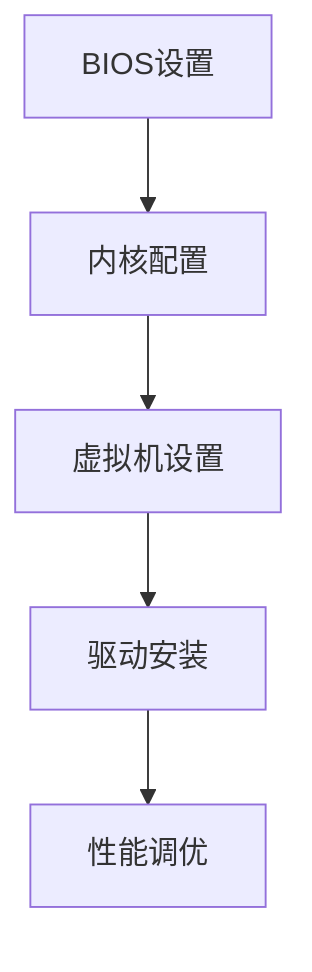

# 显卡直连方案

在 Proxmox VE 中支持显卡（尤其是您的 **七彩虹 RTX 4080**）需要通过 **GPU 直通（Passthrough）** 技术。以下是针对您配置的完整解决方案：

---

### 🚀 **GPU 直通全流程（RTX 4080 优化版）**


---

### ⚙️ **步骤 1：BIOS 关键设置（华硕 Z790）**
| **设置项** | **推荐值** | **路径** |
|------------|------------|----------|
| **Above 4G Decoding** | Enabled | Advanced > PCIe Configuration |
| **Resizable BAR** | Enabled | Advanced > PCIe Configuration |
| **VT-d** | Enabled | Advanced > System Agent Configuration |
| **SR-IOV** | Enabled | Advanced > System Agent Configuration |
| **CSM (Compatibility Support)** | Disabled | Boot > CSM |

---

### ⚙️ **步骤 2：Proxmox 主机配置**
#### 1. **启用 IOMMU**
```bash
# 编辑 GRUB
nano /etc/default/grub
```
```bash
# Intel 平台修改为：
GRUB_CMDLINE_LINUX_DEFAULT="quiet intel_iommu=on iommu=pt"
```
```bash
# 更新配置
update-grub
update-initramfs -u -k all
```

#### 2. **加载 VFIO 驱动**
```bash
echo "vfio" >> /etc/modules
echo "vfio_iommu_type1" >> /etc/modules
echo "vfio_pci" >> /etc/modules
echo "vfio_virqfd" >> /etc/modules
```

#### 3. **绑定 GPU 到 VFIO**
```bash
# 获取 GPU ID
lspci -nn | grep NVIDIA
# 输出示例： 01:00.0 VGA [0300]: NVIDIA Corporation Device [10de:2684]
```
```bash
# 创建绑定配置
echo "options vfio-pci ids=10de:2684,10de:228b disable_vga=1" > /etc/modprobe.d/vfio.conf
```

---

### ⚙️ **步骤 3：虚拟机配置（Windows 为例）**
#### 1. **创建虚拟机**
- 系统类型：`q35`
- BIOS：`OVMF (UEFI)`
- CPU：`host` 类型，开启 NUMA

#### 2. **添加 PCI 设备**
```ini
# /etc/pve/qemu-server/102.conf
machine: q35
hostpci0: 01:00.0,pcie=1,x-vga=1,romfile=vbios.rom
hostpci1: 01:00.1,pcie=1
```

#### 3. **破解 NVIDIA 限制**
```ini
args: -cpu 'host,+kvm_pv_unhalt,+kvm_pv_eoi,hv_vendor_id=proxmox'
```

---

### ⚙️ **步骤 4：vBIOS 处理（防 Code 43）**
1. **提取原始 vBIOS**：
   - 在物理 Windows 中用 GPU-Z 备份 BIOS
   - 保存为 `rtx4080.rom`

2. **打补丁**：
   ```bash
   # 在 Proxmox 中执行
   apt install python3-pip
   pip install nvidia-vbios-patcher
   nvidia-vbios-patcher rt4080.rom patched.rom
   ```

3. **放置到正确路径**：
   ```bash
   mv patched.rom /usr/share/kvm/
   ```

---

### ⚙️ **步骤 5：Windows 虚拟机优化**
#### 1. **驱动安装**
- 下载官方驱动：[NVIDIA RTX 4080 Driver](https://www.nvidia.com/drivers)
- **安装前** 在设备管理器中禁用 "Microsoft Basic Display Adapter"

#### 2. **注册表优化**
```reg
Windows Registry Editor Version 5.00

[HKEY_LOCAL_MACHINE\SYSTEM\CurrentControlSet\Control\GraphicsDrivers]
"TdrDelay"=dword:00000010

[HKEY_LOCAL_MACHINE\SOFTWARE\Microsoft\Windows NT\CurrentVersion\Virtualization]
"GPUAssignmentMitigation"=dword:00000000
```

---

### ⚡ **性能调优（RTX 4080 专属）**
#### 1. **Proxmox 主机**
```bash
# 启用 CPU 性能模式
echo performance | tee /sys/devices/system/cpu/cpu*/cpufreq/scaling_governor

# 提高 PCIe 带宽
setpci -v -d 10de:2684 CAP_EXP+0x08=0x0002
```

#### 2. **Windows 虚拟机**
```ini
# 102.conf 追加
cpu: host,hidden=1
hugepages: 1024
machine: q35,usb=on
```
```powershell
# PowerShell 执行
powercfg -setacvalueindex scheme_current sub_pcie ASPM L0sL1
```

---

### ⚠️ **七彩虹显卡特有问题解决**
#### **问题 1：风扇控制失效**
```bash
# Proxmox 主机执行
echo 1 > /sys/class/drm/card0/device/hwmon/hwmon*/pwm1_enable
echo 150 > /sys/class/drm/card0/device/hwmon/hwmon*/pwm1
```

#### **问题 2：RGB 灯效失控**
```bash
# 直通 USB 控制器
qm set 102 -hostpci2 00:14.0
```
然后在 Windows 中安装 [iGame Center](https://www.colorful.cn/product/iGameCenter)

---

### ✅ **验证成功**
```bash
# Proxmox 中检查
dmesg | grep -i vfio
# 应显示：VFIO group 1 assigned to 0000:01:00.0

# Windows 设备管理器
# 应显示：NVIDIA GeForce RTX 4080
```

---

### 🔧 **故障排除指南**
| **问题现象** | **解决方案** |
|-------------|-------------|
| 虚拟机启动黑屏 | 添加 `vga: none` 到配置文件 |
| 错误代码 43 | 确认 `args` 参数和 `romfile` 正确 |
| 性能低下 | 启用 `hugepages` 和 `CPU pinning` |
| 音频输出异常 | 直通 HDMI 音频设备（hostpci1）|

> 若仍遇问题，请提供：
> 1. `qm config 102` 输出
> 2. Windows 设备管理器截图
> 3. `dmesg | grep -i 'error|vfio'` 日志
> 我将提供定制修复方案！


---


## 驱动问题


在 Proxmox VE 中实现显卡直通（特别是您的 **七彩虹 RTX 4080**），**需要明确区分两个层面的驱动需求**：

---

### ✅ **您不需要在 Proxmox 主机安装任何显卡驱动！**
#### ⚠️ 重要原则：


---

### 📥 **您需要下载的驱动清单及作用**
| **位置**         | 所需驱动                     | 作用                                                                 | 下载来源                                                                 |
|------------------|----------------------------|---------------------------------------------------------------------|--------------------------------------------------------------------------|
| **Proxmox 主机** | 无需任何显卡驱动             | 仅需内置的 `vfio-pci` 模块（已集成在Linux内核）                          | -                                                                        |
| **Windows 虚拟机** | NVIDIA GeForce 游戏驱动     | 让 RTX 4080 在虚拟机内全功能工作（游戏/CUDA/渲染）                      | [NVIDIA 官网](https://www.nvidia.cn/Download/index.aspx?lang=cn)         |
| **Ubuntu 虚拟机** | NVIDIA Linux 驱动          | 支持 CUDA 开发/AI训练                                                | [NVIDIA Linux 驱动页](https://www.nvidia.cn/Download/driverResults.aspx/223264/) |

---

### 🔧 **关键解释**
#### 1. **为什么 Proxmox 主机不需要驱动？**
   - Proxmox 使用 **VFIO 技术** 直接接管显卡，只需内核模块：
     ```bash
     lsmod | grep vfio  # 验证模块加载
     # 应显示：vfio_pci, vfio_iommu_type1, vfio
     ```
   - 安装显卡驱动反而会导致 **宿主机占用 GPU**，无法直通！

#### 2. **为什么虚拟机内必须安装驱动？**
   - 虚拟机将 GPU 识别为 **真实物理设备**，需要原生驱动才能：
     - 启用 **光追/DLSS 3.5**（游戏必备）
     - 调用 **CUDA 核心**（开发需求）
     - 控制 **风扇转速/RGB 灯效**（七彩虹 iGame 中心）

#### 3. **驱动安装注意事项**
   **Windows 虚拟机**：
   ```powershell
   # 卸载冲突驱动（如有）
   wushowhide.diagcab  # 隐藏Windows自动安装的驱动
   DDU.exe -clean  # 安全模式下彻底卸载旧驱动
   ```
   **Ubuntu 虚拟机**：
   ```bash
   # 禁用开源驱动
   sudo nano /etc/modprobe.d/blacklist-nouveau.conf
   ```
   ```ini
   blacklist nouveau
   options nouveau modeset=0
   ```

---

### ⚠️ **七彩虹显卡特需步骤**
1. **虚拟机内安装 iGame Center**：
   - [官网下载](https://www.colorful.cn/product/iGameCenter)
   - 用于控制 **风扇曲线/RGB 灯效/超频**

2. **解决风扇失控问题**：
   ```bash
   # Proxmox 主机执行（临时调节）
   echo 150 > /sys/class/drm/card0/device/hwmon/hwmon*/pwm1
   ```

---

### 📌 **操作清单**
1. [Proxmox] 配置 GPU 直通（无需驱动）
2. [Windows VM] 下载安装 **NVIDIA Game Ready 驱动**
3. [Ubuntu VM] 下载安装 **NVIDIA Linux 驱动**
4. [可选] Windows 安装 **iGame Center**

> 验证命令：
> ```bash
> # Windows PowerShell
> nvidia-smi  # 应显示RTX 4080和驱动版本
> 
> # Ubuntu 终端
> nvcc --version  # 检查CUDA状态
> ```

---

### 💡 常见误区澄清
| **误区**                          | **事实**                                                                 |
|----------------------------------|-------------------------------------------------------------------------|
| “Proxmox 需要装 NVIDIA 驱动”      | ❌ 错误！会导致直通失败                                                   |
| “虚拟机驱动和物理机相同”          | ✅ 正确！直接使用官网驱动即可                                             |
| “直通后需要特殊驱动”              | ❌ 错误！虚拟机内驱动与物理机 100% 相同                                  |

**总结**：只需在虚拟机内安装原生驱动，Proxmox 主机保持“无驱动”状态！