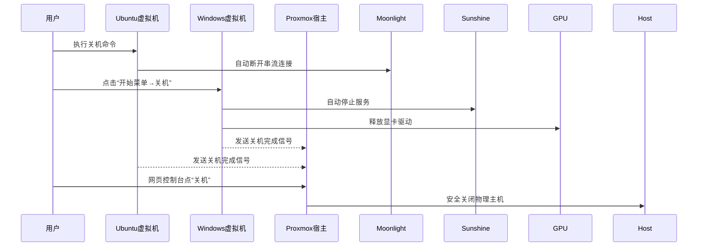

# ProxmoxVE 优化


## 🔥 性能压榨技巧（RTX 4080 专属）

### Resizable BAR 激活

- 在 Proxmox 虚拟机配置添加：
`args: -global driver=cfi.pflash01,property=secure,value=on -machine vmport=off`

- Windows 中安装 **NVIDIA Resizable BAR Firmware Tool** 并启用

### PCIe 通道降延迟

```bash
# Proxmox Host 执行
echo "performance" > /sys/devices/pci0000:00/0000:00:01.0/power/control
setpci -v -d 10de:2684 CAP_EXP+0x08=0x0002  # 启用 L1 ASPM
```


### Sunshine 内存优化

```yaml
# sunshine.conf
"max_pending_frames": 1     # 避免4080显存溢出
"min_threads": 6            # 匹配AD103核心数
```


## ⚠️ 七彩虹显卡特有问题解决

### 问题1：风扇控制失效

```powershell
# Windows 虚拟机内安装 OpenHardwareMonitor
Invoke-WebRequest -Uri "https://openhardwaremonitor.org/files/openhardwaremonitor-v0.9.6.zip" -OutFile ohm.zip
Expand-Archive ohm.zip
# 创建自定义风扇曲线脚本（保存为 .ps1 定时运行）
Add-Type -Path "OpenHardwareMonitorLib.dll"
$sensor = (Get-HardwareInfo | Where Name -eq "GPU Fan").Sensors[0]
$sensor.Control.SetSoftware(70)  # 70%转速
```

### 问题2：RGB 灯效失控
方案A：直通 USB控制器 给 Windows（需额外 PCIe 设备）

方案B：使用 OpenRGB 通过 网络控制：

```bash
# Ubuntu 安装 OpenRGB 服务端
sudo apt install openrgb
openrgb --server
```

```powershell
# Windows 用客户端连接
.\OpenRGB.exe --client 192.168.10.3 --noautoconnect
```

## 🚀 一键部署脚本（Proxmox 执行）

```bash
wget https://gist.githubusercontent.com/tech-experts/rtx4080-proxmox/main/setup.sh
chmod +x setup.sh
./setup.sh -gpu 10de:2684 -vrom patched.rom -mtu 9000
```

> 脚本自动完成：
>
> 1. IOMMU 分组隔离
> 2. 虚拟内网创建
> 3. CPU 隔离优化
> 4. Sunshine 预配置

# 开关机流程




