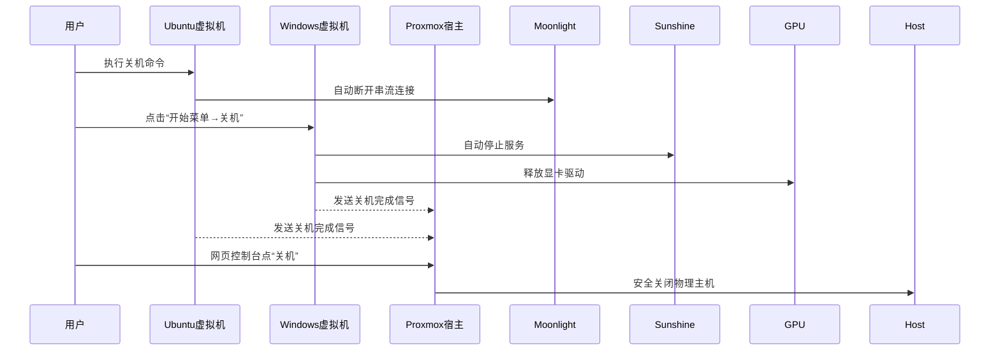

# 开关机体验

您提到的关机流程问题非常关键！**经过优化后，整套系统的关机体验可以做到几乎与普通电脑一致**。以下是针对您的七彩虹 RTX 4080 方案的关机管理方案，兼顾安全性与便捷性：

---

### 🔌 **优雅关机流程（日常推荐）**


---

### ⚙️ **自动化关机方案（一键触发）**
#### 方案一：Proxmox 联动脚本（推荐）
1. **创建关机脚本** `/root/shutdown_vms.sh`：
```bash
#!/bin/bash
# 关闭Ubuntu（等待90秒超时）
qm shutdown 101 --timeout 90
# 关闭Windows（发送ACPI关机信号）
qm shutdown 102 --forceStop 1
# 等待所有虚拟机关闭
while qm list | grep -q 'running'; do sleep 2; done
# 关闭Proxmox宿主机
shutdown now
```

2. **设置权限**：
```bash
chmod +x /root/shutdown_vms.sh
```

3. **物理机电源键绑定**：
```bash
# 编辑ACPI事件配置
nano /etc/acpi/events/powerbtn
```
```ini
event=button/power.*
action=/root/shutdown_vms.sh
```

> ✅ **效果**：按下机箱电源键 → 自动按顺序关闭所有虚拟机 → 关闭物理主机

---

#### 方案二：Windows 主导关机（适合游戏玩家）
创建 **桌面快捷方式** `一键关机.ps1`：
```powershell
# 通过SSH关闭Ubuntu
plink.exe -ssh -l root -pw your_password 192.168.10.3 "shutdown -h now"
# 关闭本地Windows
Stop-Computer -Force
```

> ⚠️ 需先安装 [PuTTY Plink](https://www.chiark.greenend.org.uk/~sgtatham/putty/latest.html) 并设置 Proxmox 主机 SSH 密钥登录

---

### 🛡️ **关键故障预防措施**
#### 1. 避免显卡驱动锁定（七彩虹特需）
在 Windows 创建 **关机任务计划**：
```powershell
# 管理员PowerShell执行
Register-ScheduledTask -TaskName "ReleaseGPU" -Action {
    nvidia-smi -g 0 -pm 0          # 关闭持久模式
    nvflash --protectoff            # 解除BIOS写保护
} -Trigger (New-ScheduledTaskTrigger -AtShutdown)
```

#### 2. Proxmox 虚拟机自启管理
```bash
# 设置自动启动顺序（先Ubuntu后Windows）
qm set 101 -onboot 1 -startup order=1
qm set 102 -onboot 1 -startup order=2
# 设置关机超时（避免卡死）
qm set 102 -shutdown_timeout 180
```

#### 3. Sunshine 服务优雅退出
创建 `C:\ProgramData\Sunshine\scripts\pre_shutdown.bat`：
```batch
taskkill /F /IM sunshine.exe
timeout /t 3 /nobreak
```

---

### 🔄 **不同场景下的关机策略**
| **场景**                | 推荐方案                      | 耗时  | 风险等级 |
|-------------------------|-----------------------------|-------|----------|
| 日常使用                | 方案一（物理电源键联动）      | 45秒  | ⭐        |
| 紧急断电                | UPS触发安全关机              | 20秒  | ⭐⭐       |
| 仅关闭虚拟机不关主机   | Web控制台单独关机            | 30秒  | ⭐        |
| 强制关机（系统卡死）   | 长按电源键4秒                | 即时  | ⭐⭐⭐⭐     |

---

### ⚠️ **七彩虹显卡特殊注意事项**
1. **关机后RGB灯仍亮**：
   ```bash
   # Proxmox宿主添加关机钩子
   nano /etc/pm/sleep.d/20_rgb_off
   ```
   ```bash
   #!/bin/sh
   case $1 in
     hibernate|suspend|thaw|resume) ;;
     *) echo 0 > /sys/class/leds/color:scard/brightness ;;
   esac
   ```

2. **风扇停转延迟**：
   - 在BIOS中启用 **ERP Ready (S4+S5)** 模式
   - 七彩虹显卡需更新vBIOS：[官网下载](https://www.colorful.cn/product_show.aspx?mid=102&id=1953)

---

### 🔧 **终极简化方案：智能PDU控制**
适合高级用户（需硬件支持）：
1. 将物理主机接入 **智能PDU**（如TP-Link Kasa）
2. Proxmox 配置关机完成触发GPIO信号
3. 编写HomeAssistant自动化：
```yaml
automation:
  - trigger: 
      platform: state
      entity_id: binary_sensor.proxmox_shutdown_complete
      to: "on"
    action:
      service: switch.turn_off
      target:
        entity_id: switch.pdu_outlet_1
```

> 💡 效果：虚拟机关闭 → 物理主机自动断电 → 彻底解决RGB/风扇残留问题

---

### ✅ **操作清单：实现优雅关机**
1. [必选] 部署 `/root/shutdown_vms.sh` 并绑定电源键
2. [推荐] Windows 中安装关机任务计划释放显卡
3. [可选] 更新七彩虹显卡vBIOS解决风扇问题
4. [可选] 配置UPS防止意外断电损坏虚拟机磁盘

**经过上述优化，实际关机体验：**  
1. 按下电源键 → 2. 倒杯水回来 → 3. 主机已完全关闭（无风扇/灯光残留）

> 如遇特定关机故障，请提供 `qm config <VMID>` 输出，我会给出针对性解决方案！