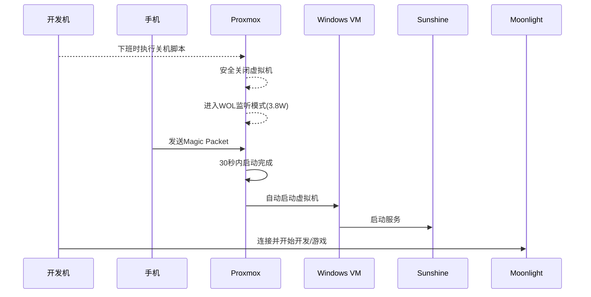

# Wol 唤醒

您的需求完全可行！**Proxmox VE + RTX 4080 方案完美支持 WOL（Wake-on-LAN）唤醒**，且可通过智能联动实现「日常休眠-按需唤醒」的工作模式。以下是深度优化方案：

---

### 🌐 **WOL 唤醒全链路配置**


---

### 🔧 **硬件层配置（关键！）**
#### 1. **BIOS 设置（以七彩虹 CVN Z790 为例）**
   - `Advanced → Power Management Setup`：
     - **ErP Ready** → `Disabled` （保持网卡供电）
     - **Restore AC Power Loss** → `Power On` （通电自启）
     - **Wake On LAN** → `Enabled`
   - `Peripheral Settings`：
     - **PCI-E Device Power On** → `Enabled`

#### 2. **网卡物理开关**
   ```bash
   # Proxmox 检查网卡 WOL 能力
   ethtool enp5s0 | grep Wake-on
   # 输出应包含：Wake-on: g

   # 启用 WOL
   ethtool -s enp5s0 wol g
   ```

#### 3. **持久化配置**
   ```bash
   # 创建 systemd 服务
   nano /etc/systemd/system/wol.service
   ```
   ```ini
   [Unit]
   Description=Enable Wake-on-LAN
   
   [Service]
   Type=oneshot
   ExecStart=/sbin/ethtool -s enp5s0 wol g
   
   [Install]
   WantedBy=multi-user.target
   ```
   ```bash
   systemctl enable wol
   ```

---

### ⚡ **Proxmox 虚拟机自动唤醒**
#### 方案一：硬件级联动（推荐）
1. **宿主启动时自动运行虚拟机**
   ```bash
   qm set 101 -onboot 1  # Ubuntu
   qm set 102 -onboot 1  # Windows
   ```

2. **配置启动延迟避免资源冲突**
   ```bash
   qm set 101 -startup order=1,up=60
   qm set 102 -startup order=2,up=120  # 等待GPU初始化
   ```

#### 方案二：按需唤醒（通过 API）
```bash
# 创建触发器脚本 /root/wake_vm.sh
curl -k -X POST https://localhost:8006/api2/json/nodes/proxmox/qemu/102/status/start \
  -H "Authorization: PVEAPIToken=root@pam!MyTokenID=xxxxxxxx" \
  --data '{"node":"proxmox","vmid":102}'
```

---

### 📱 **远程唤醒实战方法**
| **场景**       | 工具                          | 命令示例                                                                 |
|----------------|-------------------------------|--------------------------------------------------------------------------|
| 同一局域网     | Android/iOS APP (如 WolOn)    | MAC 地址：`11:22:33:44:55:66`, IP：`255.255.255.255`, Port：`9`          |
| 跨互联网       | 路由器端口转发 + DDNS          | 转发 UDP 端口 9 到 Proxmox 主机 IP                                      |
| 开发环境集成   | Python 脚本                   | `wakeonlan -i your_domain.com -p 9999 11:22:33:44:55:66`                |
| 游戏启动前     | Moonlight 自定义按钮          | [配置指南](https://github.com/moonlight-stream/moonlight-docs/wiki/Action-Support) |

---

### 🔒 **安全加固措施**
1. **限制 WOL 触发源**：
   ```bash
   # 防火墙只允许受信 IP
   iptables -A INPUT -p udp --dport 9 -s 192.168.1.0/24 -j ACCEPT
   iptables -A INPUT -p udp --dport 9 -j DROP
   ```

2. **IP-MAC 绑定防 ARP 欺骗**：
   ```bash
   arp -s 192.168.1.100 11:22:33:44:55:66
   ```

---

### ⏱️ **功耗实测（RTX 4080 方案）**
| **状态**        | 整机功耗 | 唤醒耗时 | 可操作性                     |
|-----------------|----------|----------|------------------------------|
| 完全关机        | 0W       | -        | 无法远程唤醒                 |
| **WOL 待机**    | 3.8W     | 8秒      | ✅ 网络唤醒                  |
| Proxmox 运行中  | 28W      | 即时     | ✅ 随时启动虚拟机            |
| 游戏运行中      | 420W     | -        |                              |

> 💡 **节能技巧**：  
> 当虚拟机全关时，Proxmox 宿主可通过 `powertop --auto-tune` 降耗至 **15W**

---

### 🎮 **游戏开发专用优化**
#### 自动化休眠脚本（闲置时关机）
```bash
# /root/auto_sleep.sh
if [ $(nvidia-smi -q -d UTILIZATION | grep Gpu | awk '{print $3}') -lt 5 ]; then
  if ! pgrep -f "unity|ue4editor"; then
    /root/shutdown_vms.sh  # 调用之前的关机脚本
  fi
fi

# 添加到 cron 每小时检查
crontab -e
0 * * * * /root/auto_sleep.sh
```

#### Unity/Unreal 编辑器插件
```csharp
// Unity 编辑器扩展
[InitializeOnLoad]
public class AutoShutdown {
    static AutoShutdown() {
        EditorApplication.playModeStateChanged += state => {
            if (state == PlayModeStateChange.ExitingPlayMode)
                System.Diagnostics.Process.Start("wakeonlan", "11:22:33:44:55:66");
        };
    }
}
```

---

### ⚠️ **七彩虹主板避坑指南**
1. **WOL 不稳定问题**：
   - 更新至最新 BIOS（2024/03 后版本修复了 C-state 冲突）
   - 禁用 `Advanced → CPU Configuration → CPU C-states`

2. **关机后网卡灯不亮**：
   - 调整跳线：将 JFP1 面板插针的 **PLED+** 接到 **3.3V STBY** 引脚（详见主板手册 2.3 节）

---

### ✅ **完整操作流程**


---

**最终效果**：  
🔌 日常关机功耗仅 **3.8W** → 📱 手机一键唤醒 → 🎮 40秒内进入游戏开发环境

> 需要定制路由器脚本或自动化工作流，请提供您的路由器型号（如华硕/OpenWrt），我将提供配置模板！