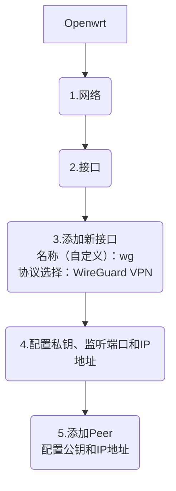

# WireGuard VPN

- [官网](https://www.wireguard.com/)
- [密码生成](https://www.wireguard.com/quickstart/#key-generation)

## 密钥生成

WireGuard 需要 base64-encoded 的公钥和私钥。这些可以使用 wg(8) 实用程序生成:

```shell
$ umask 077
$ wg genkey > privatekey
```

这将在包含新私钥的 stdout 上创建 privatekey。

然后，您可以从您的私钥派生您的公钥:

```shell
$ wg pubkey < privatekey > publickey
```

这将从 stdin 读取 privatekey，并将相应的公钥写入 stdout 上的 publickey。

当然，你可以一次做到这一点:

```shell
$ wg genkey | tee privatekey | wg pubkey > publickey
```

---

## Openwrt 配置

### 启用Wireguard



#### 4.配置私钥、监听端口和IP地址

> 这里创建的是服务端配置。

这里私钥、端口和Ip地址主要用于服务器。

**私钥**：通过`wg genkey`获取。wg会自动生成publickey

**端口**：自己定义，默认是51820。建议是定义一个随机的

**IP地址**：需要指定ip段，并指定网关地址。例如：`192.168.2.1/24`


#### 5 添加Peer</br>配置公钥和IP地址

> 这里配置客户端

**公钥**：生成客户端密钥对，公钥放在这里

**IP地址**：设置客户端在服务端的IP地址。比如：192.168.2.2

---

### 防火墙配置

新增通信规则：


添加后配置：

- 协议：UDP
- 源区域：wan（wan，wan6）
- 源端口：不填写
- 目标区域：设备（输入）
- 目标端口：与服务端配置端口一直，如果没配置，使用默认 51820


